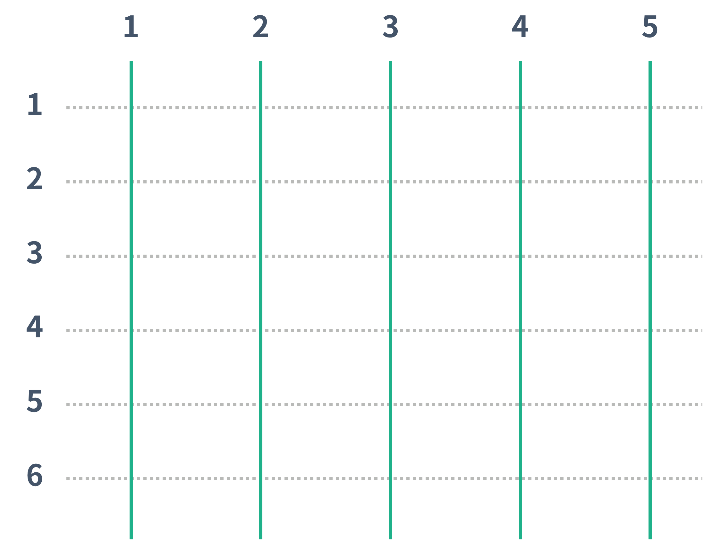
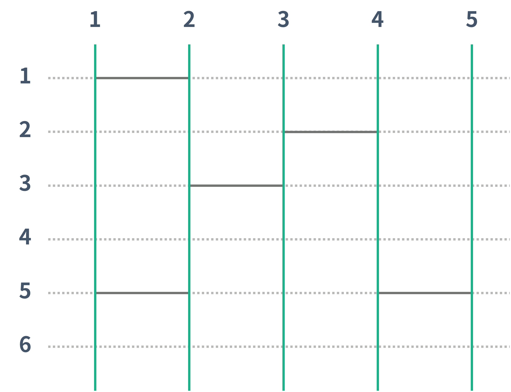
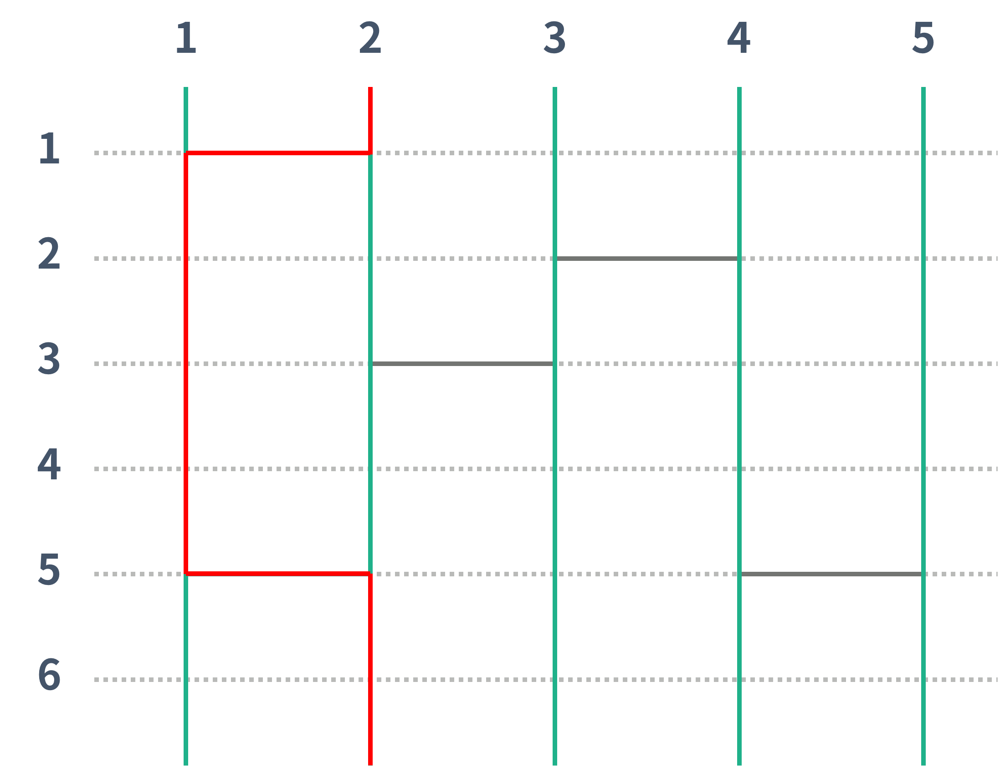

## 200801 15684 사다리 조작

## 문제

사다리 게임은 N개의 세로선과 M개의 가로선으로 이루어져 있다. 인접한 세로선 사이에는 가로선을 놓을 수 있는데, 각각의 세로선마다 가로선을 놓을 수 있는 위치의 개수는 H이고, 모든 세로선이 같은 위치를 갖는다. 아래 그림은 N = 5, H = 6 인 경우의 그림이고, 가로선은 없다.



초록선은 세로선을 나타내고, 초록선과 점선이 교차하는 점은 가로선을 놓을 수 있는 점이다. 가로선은 인접한 두 세로선을 연결해야 한다. 단, 두 가로선이 연속하거나 서로 접하면 안 된다. 또, 가로선은 점선 위에 있어야 한다.



위의 그림에는 가로선이 총 5개 있다. 가로선은 위의 그림과 같이 인접한 두 세로선을 연결해야 하고, 가로선을 놓을 수 있는 위치를 연결해야 한다.

사다리 게임은 각각의 세로선마다 게임을 진행하고, 세로선의 가장 위에서부터 아래 방향으로 내려가야 한다. 이때, 가로선을 만나면 가로선을 이용해 옆 세로선으로 이동한 다음, 이동한 세로선에서 아래 방향으로 이동해야 한다.

위의 그림에서 1번은 3번으로, 2번은 2번으로, 3번은 5번으로, 4번은 1번으로, 5번은 4번으로 도착하게 된다. 아래 두 그림은 1번과 2번이 어떻게 이동했는지 나타내는 그림이다.

|  |  |
| ---------------------------- | ---------------------------- |
| 1번 세로선                   | 2번 세로선                   |

사다리에 가로선을 추가해서, 사다리 게임의 결과를 조작하려고 한다. 이때, i번 세로선의 결과가 i번이 나와야 한다. 그렇게 하기 위해서 추가해야 하는 가로선 개수의 최솟값을 구하는 프로그램을 작성하시오.

## 입력

첫째 줄에 세로선의 개수 N, 가로선의 개수 M, 세로선마다 가로선을 놓을 수 있는 위치의 개수 H가 주어진다. (2 ≤ N ≤ 10, 1 ≤ H ≤ 30, 0 ≤ M ≤ (N-1)×H)

둘째 줄부터 M개의 줄에는 가로선의 정보가 한 줄에 하나씩 주어진다.

가로선의 정보는 두 정수 a과 b로 나타낸다. (1 ≤ a ≤ H, 1 ≤ b ≤ N-1) b번 세로선과 b+1번 세로선을 a번 점선 위치에서 연결했다는 의미이다.

가장 위에 있는 점선의 번호는 1번이고, 아래로 내려갈 때마다 1이 증가한다. 세로선은 가장 왼쪽에 있는 것의 번호가 1번이고, 오른쪽으로 갈 때마다 1이 증가한다.

입력으로 주어지는 가로선이 서로 연속하는 경우는 없다.

## 출력

i번 세로선의 결과가 i번이 나오도록 사다리 게임을 조작하려면, 추가해야 하는 가로선 개수의 최솟값을 출력한다. 만약, 정답이 3보다 큰 값이면 -1을 출력한다. 또, 불가능한 경우에도 -1을 출력한다.

## 예제 입력 1 복사

```
2 0 3
```

## 예제 출력 1 복사

```
0
```

## 예제 입력 2 복사

```
2 1 3
1 1
```

## 예제 출력 2 복사

```
1
```

## 예제 입력 3 복사

```
5 5 6
1 1
3 2
2 3
5 1
5 4
```

## 예제 출력 3 복사

```
3
```

## 예제 입력 4 복사

```
6 5 6
1 1
3 2
1 3
2 5
5 5
```

## 예제 출력 4 복사

```
3
```

## 예제 입력 5 복사

```
5 8 6
1 1
2 2
3 3
4 4
3 1
4 2
5 3
6 4
```

## 예제 출력 5 복사

```
-1
```

## 예제 입력 6 복사

```
5 12 6
1 1
1 3
2 2
2 4
3 1
3 3
4 2
4 4
5 1
5 3
6 2
6 4
```

## 예제 출력 6 복사

```
-1
```

## 예제 입력 7 복사

```
5 6 6
1 1
3 1
5 2
4 3
2 3
1 4
```

## 예제 출력 7 복사

```
2
```

## 200305 Code

---

```python
import sys
def move():
    for j in range(1, N+1): # 열 위치를 고정 시키고
        y = j
        for i in range(1, H+1): # 행위치를 조절
            if ladder[i][y]: # 만약 오른쪽으로 갈 수 있다면 y += 1
                y += 1
            elif ladder[i][y-1]: # 만약 왼쪽으로 갈 수 있다면 y -= 1
                y -= 1
        if j != y: # 행이 끝까지 내려왔을 때 최종 열이 처음 열과 다르면
            return 0 # 0을 기록하고 끝
    return 1 # 모두 다 돌았을 때 조건이 만족된다면 1을 기록

def dfs(y, cnt, minV):
    global flag
    if cnt == minV: # 놓은 사다리 수가 0, 1, 2, 3 중에 있다면
        if move():
            flag = 1 # 사다리 게임을 진행했을 때 조건을 만족한다면 끝
            return
    else:
        for j in range(y, N):
            for i in range(1, H+1):
                if not(ladder[i][j-1] or ladder[i][j] or ladder[i][j+1]): # 오른쪽, 왼쪽 이동이 가능하므로, 좌 중간 우, 세 위치 다 봐야함
                    ladder[i][j] = 1
                    dfs(j, cnt+1, minV) # 열 위치가 동일하면서 행 위치만 바뀔 수 있기 때문에
                    ladder[i][j] = 0
                elif flag: # 만약 위치를 찾았다면 더 이상 진행하지 않고 끝
                    return

N, M, H = map(int, sys.stdin.readline().split())
ladder = [[0] * (N+1) for _ in range(H+1)]
flag = 0
answer = -1
for _ in range(M):
    row, col = map(int, sys.stdin.readline().split())
    ladder[row][col] = 1 # 연결된 사다리 표시

for minV in range(4):
    dfs(1, 0, minV)
    if flag:
        answer = minV # 조건을 다 맞췄으면 끝
        break
print(answer)
```

## 200801 Code

---

```python
import sys; input = sys.stdin.readline


def game():
    for idx in range(1, N+1):
        y = idx
        for x in range(1, H+1):
            if ladder[x][y]:
                y += 1
            elif ladder[x][y-1]:
                y -= 1
            # 왜 안되지???
            # if y < H+1 and ladder[x][y]:
            #     y += 1
            # elif y > 1 and ladder[x][y-1]:
            #     y -= 1
        if y != idx:
            return 0
    return 1

def set_ladder(cnt, idx, maxL):
    global flag
    if cnt == maxL:
        if game():
            flag = 1
            return
    else:
        for i in range(1, H+1):
            for j in range(idx, N):
                if not ladder[i][j] and not ladder[i][j-1] and not ladder[i][j+1]:
                    ladder[i][j] = 1
                    set_ladder(cnt+1, j, maxL)
                    ladder[i][j] = 0
                elif flag:
                    return


N, M, H = map(int, input().split())
ladder = [[0] * (N+1) for _ in range(H+1)]
flag = 0
answer = -1
for _ in range(M):
    a, b = map(int, input().split())
    ladder[a][b] = 1
for i in range(4):
    set_ladder(0, 1, i)
    if flag:
        answer = i
        break
print(answer)
```

