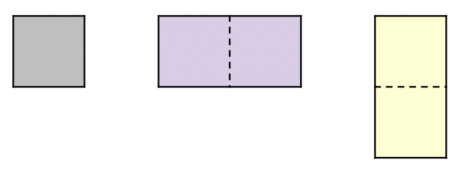

# 200707 19235 모노미노도미노

## 문제

모노미노도미노는 아래와 같이 생긴 보드에서 진행되는 게임이다. 보드는 빨간색 보드, 파란색 보드, 초록색 보드가 그림과 같이 붙어있는 형태이다. 게임에서 사용하는 좌표 (x, y)에서 x는 행, y는 열을 의미한다. 빨간색, 파란색, 초록색 보드가 사용하는 좌표는 그 색으로 그림에 적혀있다.


<그림 1> 모노미노도미노 게임 보드

이 게임에서 사용하는 블록은 타일 하나 또는 두 개가 가로 또는 세로로 붙어있는 형태이다. 아래와 같이 세 종류가 있으며, 왼쪽부터 순서대로 크기가 1×1, 1×2, 2×1 이다.



<그림 2> 모노미노도미노 게임에서 사용하는 블록

블록을 놓을 위치를 빨간색 보드에서 선택하면, 그 위치부터 초록색 보드로 블록이 이동하고, 파란색 보드로 블록이 이동한다. 블록의 이동은 다른 블록을 만나거나 보드의 경계를 만나기 전까지 계속해서 이동한다. 예를 들어, 크기가 1×1인 블록을 (1, 1)에 놓으면, 보드의 상태는 <그림 3>과 같이 변한다.


<그림 3>

여기서 크기가 1×2인 블록을 (3, 0)과 (3, 1)에 놓으면 <그림 4>와 같이 보드의 상태가 변한다.


<그림 4>

다시 이 상태에서 크기가 2×1인 블록을 (2, 2), (3, 2)와 (2, 3), (3, 3)에 놓으면 <그림 5>와 같이 변한다.


<그림 5>

초록색 보드의 4번 행은 모든 칸이 타일로 가득 차있다. 이렇게 초록색 보드에서 어떤 행이 타일로 가득 차 있다면, 그 행의 타일은 모두 사라진다. 사라진 이후에는 초록색 보드에서 각 블록이 다른 블록을 만나거나 경계를 만나기 전까지 아래로 이동한다. 파란색의 경우는 열이 타일로 가득 차 있으면, 그 열의 타일이 모두 사라지며, 사라진 이후에는 파란색 보드에서 각 블록이 다른 블록을 만나거나 경계를 만나기 전까지 오른쪽으로 이동한다. 이렇게 한 행이나 열이 타일로 가득 차서 사라지면 1점을 획득한다. 점수는 사라진 행 또는 열의 수와 같다. 만약, 두 개의 행이 사라지면 2점을 획득하게 되고, 한 행과 한 열이 사라져도 2점을 획득하게 된다. 위의 보드는 아래와 같이 변하고, 1점을 얻는다.


<그림 6>

여기서 크기가 2×1인 블록을 (1, 3), (2, 3)에 놓으면 보드는 <그림 7>과 같이 변한다.


<그림 7>

초록색 보드의 0, 1번 행과 파란색 보드의 0, 1번 열은 그림에는 연한색으로 표현되어 있는 특별한 칸이다. 초록색 보드의 0, 1번 행에 블록이 있으면, 블록이 있는 행의 수만큼 아래 행에 있는 타일이 사라지고, 초록색 보드의 모든 블록이 아래로 경계를 만나기 전까지 이동하고, 파란색 보드의 0, 1번 열에 블록이 있으면, 블록이 있는 열의 수만큼 오른쪽 열에 있는 타일이 사라지고, 파란색 보드의 모든 블록이 오른쪽으로 경계를 만나기 전까지 이동하게 된다. 위의 그림은 파란색 보드의 1번 열에 블록이 있기 때문에, 5번 열에 있는 블록이 모두 사라지고, 파란색 보드의 모든 블록이 오른쪽으로 한 칸 이동하게 된다. 따라서, 보드는 <그림 8>과 같이 변하게 된다.


<그림 8>

위의 보드에서 1×2인 블록을 (0, 0), (0, 1)에 놓으면 <그림 9>와 같다.


<그림 9>

여기서 크기가 2×1인 블록을 (2, 0), (3, 0)에 놓으면 <그림 10>과 같이 변한다. 파란색 보드는 1번 열에 블록이 생겨서 오른쪽으로 한 칸씩 이동한 상태이다.


<그림 10>

크기가 2×1인 블록을 (1, 2), (2, 2)에 놓으면, <그림 11>과 같이 변한다.


<그림 11>

파란색 보드는 1번 열에 블록이 있기 때문에, 5번 열의 타일이 사라지고 모든 블록이 오른쪽으로 한 칸씩 이동하게 된다. 초록색 보드는 4번 행의 모든 칸에 타일이 있기 때문에, 1점을 얻으면서, 4번 행의 모든 타일이 사라진다.


<그림 12>

<그림 12>는 <그림 11>의 상태에서 파란색 보드는 모든 블록이 오른쪽으로 한 칸 이동했고, 초록색 보드의 4번 행이 모두 사라진 상태이다. 이제, 초록색 보드에서 나머지 블록이 아래로 경계나 다른 블록을 만나기 전까지 내려와야 한다. 여기서 다시 <그림 13>과 같이 5번 행의 모든 칸에 타일이 가득차게 된다.


<그림 13>

블록의 이동 때문에, 다시 행이나 열이 타일로 가득차는 경우가 또 발생할 수도 있다. 이 경우에도 1점을 얻고, 그 행이나 열의 모든 타일을 제거하고 다시 나머지 블록을 이동하면 된다. 따라서, <그림 11>의 최종 결과는 <그림 14>가 된다.


<그림 14>

행이나 열이 타일로 가득찬 경우와 연한 칸에 블록이 있는 경우가 동시에 발생할 수 있다. 이 경우에는 행이나 열이 타일로 가득 찬 경우가 없을 때까지 점수를 획득하는 과정이 모두 진행된 후, 연한 칸에 블록이 있는 경우를 처리해야 한다.

블록은 보드에 놓인 이후에 다른 블록과 합쳐지지 않는다. 나누어지는 경우는 행이나 열이 타일로 가득찬 경우에 발생할 수 있다. 초록색 보드에서는 2×1 블록에서 일부가 사라져서 1×1 블록이 될 수 있고, 파란색 보드에서는 1×2 블록에서 일부가 사라져서 1×1 블록이 될 수 있다.

블록을 놓은 위치가 순서대로 주어졌을 때, 얻은 점수와 초록색 보드와 파란색 보드에 타일이 있는 칸의 개수를 모두 구해보자.

## 입력

첫째 줄에 블록을 놓은 횟수 N(1 ≤ N ≤ 10,000)이 주어진다.

둘째 줄부터 N개의 줄에 블록을 놓은 정보가 한 줄에 하나씩 순서대로 주어지며, `t x y`와 같은 형태이다.

- t = 1: 크기가 1×1인 블록을 (x, y)에 놓은 경우
- t = 2: 크기가 1×2인 블록을 (x, y), (x, y+1)에 놓은 경우
- t = 3: 크기가 2×1인 블록을 (x, y), (x+1, y)에 놓은 경우

블록이 차지하는 칸이 빨간색 칸의 경계를 넘어가는 경우는 입력으로 주어지지 않는다.

## 출력

첫째 줄에 블록을 모두 놓았을 때 얻은 점수를 출력한다.

둘째 줄에는 파란색 보드와 초록색 보드에서 타일이 들어있는 칸의 개수를 출력한다.

## 예제 입력 1 복사

```
1
1 1 1
```

## 예제 출력 1 복사

```
0
2
```

<그림 3>과 같다.

## 예제 입력 2 복사

```
2
1 1 1
2 3 0
```

## 예제 출력 2 복사

```
0
6
```

<그림 4>와 같다.

## 예제 입력 3 복사

```
4
1 1 1
2 3 0
3 2 2
3 2 3
```

## 예제 출력 3 복사

```
1
10
```

<그림 6>과 같다.

## 예제 입력 4 복사

```
5
1 1 1
2 3 0
3 2 2
3 2 3
3 1 3
```

## 예제 출력 4 복사

```
1
12
```

<그림 8>과 같다.

## 예제 입력 5 복사

```
6
1 1 1
2 3 0
3 2 2
3 2 3
3 1 3
2 0 0
```

## 예제 출력 5 복사

```
1
16
```

<그림 9>와 같다.

## 예제 입력 6 복사

```
7
1 1 1
2 3 0
3 2 2
3 2 3
3 1 3
2 0 0
3 2 0
```

## 예제 출력 6 복사

```
1
18
```

<그림 10>과 같다.

## 예제 입력 7 복사

```
8
1 1 1
2 3 0
3 2 2
3 2 3
3 1 3
2 0 0
3 2 0
3 1 2
```

## 예제 출력 7 복사

```
3
11
```

<그림 14>와 같다.

## 출처

- 문제를 만든 사람: [baekjoon](https://www.acmicpc.net/user/baekjoon)

## Code

---

```python
import sys; input = sys.stdin.readline


def down(matrix):
    while True:
        flag = 0
        for i in range(dark-1, -1, -1):
            for j in range(4):
              	# 현재 칸은 있고 그 밑에 칸은 0일 경우
                if matrix[i][j] and not matrix[i+1][j]:
                  	# 2번 블록의 경우 오른쪽과 같을 경우
                    if j < 3 and matrix[i][j] == matrix[i][j+1]:
                      	# 오른쪽 밑에 블록이 0일 경우
                        if not matrix[i+1][j+1]:
                            matrix[i][j], matrix[i+1][j] = matrix[i+1][j], matrix[i][j]
                            matrix[i][j+1], matrix[i+1][j+1] = matrix[i+1][j+1], matrix[i][j+1]
                            flag = 1
                    # 2번 블록의 경우 왼쪽과 같을 경우
                    elif j > 0 and matrix[i][j] == matrix[i][j-1]:
                      	# 왼쪽 밑에 블록이 0일 경우
                        if not matrix[i+1][j-1]:
                            matrix[i][j], matrix[i+1][j] = matrix[i+1][j], matrix[i][j]
                            matrix[i][j-1], matrix[i+1][j-1] = matrix[i+1][j-1], matrix[i][j-1]
                            flag = 1
                    # 1번, 3번 블록은 그냥 내리면된다.
                    else:
                        matrix[i][j], matrix[i+1][j] = matrix[i+1][j], matrix[i][j]
                        flag = 1
        # 한 칸씩 내리기 때문에 다 내려갈 때까지 반복
        if not flag:
            return

def remove(matrix):
    global answer
    while True:
        flag = 0
        for i in range(dark, light, -1):
          	# matrix의 한 행이 다 찼을 경우
            if 0 not in matrix[i]:
                matrix[i] = [0] * 4
                answer += 1
                flag = 1
        # 없앤 경우엔 블록을 내린다.
        if flag:
            down(matrix)
        # 아닐 경우 light 부분에 있는 블록을 탐색
        else:
            tmp = 0
            for j in range(light+1):
              	# light영역에 블록이 있는 경우
                if sum(matrix[j]):
                    tmp += 1
            if tmp:
              	# 블록이 있는 행 수 만큼, 추가하고 마지막 행을 없앤다.
                for _ in range(tmp):
                    matrix = [[0] * 4] + matrix
                    matrix.pop()
                # 내린다.
                down(matrix)
            else:
                break
    return matrix

def move(num, y, t, matrix):
  	# 위에서 부터 탐색
    for i in range(dark+1):
        if t == 1:
            if matrix[i][y]:
                matrix[i-1][y] = num
                break
            elif i == dark:
                matrix[i][y] = num
        elif t == 2:
            if matrix[i][y] or matrix[i][y+1]:
                matrix[i-1][y], matrix[i-1][y+1] = num, num
                break
            elif i == dark:
                matrix[i][y], matrix[i][y + 1] = num, num
        elif t == 3:
            if matrix[i][y]:
                matrix[i-2][y], matrix[i-1][y] = num, num
                break
            elif i == dark:
                matrix[i-1][y], matrix[i][y] = num, num
    return matrix


N = int(input())
light, dark = 1, 5
# green을 y=x 대칭하면 blue
green = [[0] * 4 for _ in range(dark+1)]
blue = [[0] * 4 for _ in range(dark+1)]
answer = 0
for i in range(N):
    t, x, y = map(int, input().split())
    num = i + 1
    # green은 y값 그대로
    move(num, y, t, green)
    # green -> blue, 2 -> 3, 3 -> 2 모양 변경
    if t == 2:
        t = 3
    elif t == 3:
        t = 2
    # blue는 x값 그대로
    move(num, x, t, blue)
    # 제거
    green = remove(green)
    blue = remove(blue)
# 남아있는 블록 갯수
cnt = 0
for i in range(dark+1):
    for j in range(4):
        if green[i][j]:
            cnt += 1
        if blue[i][j]:
            cnt += 1
print(answer)
print(cnt)
```

