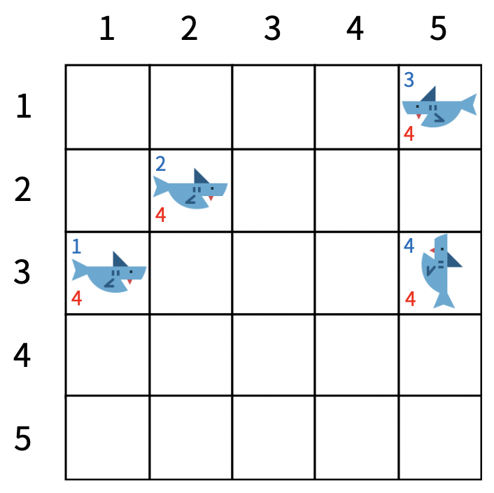
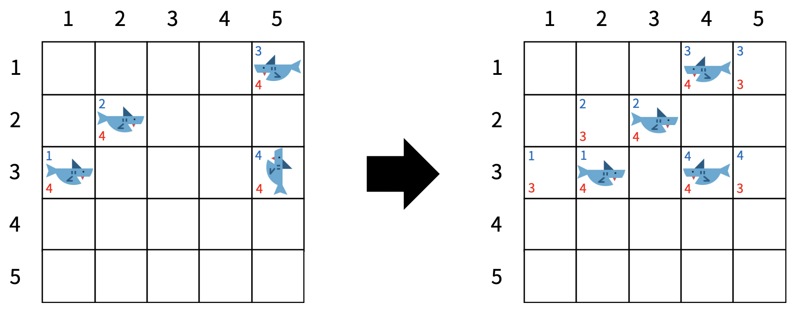
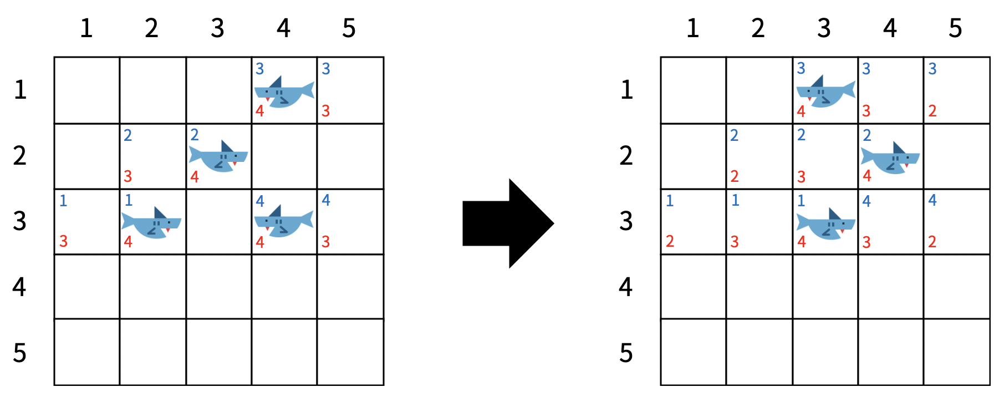
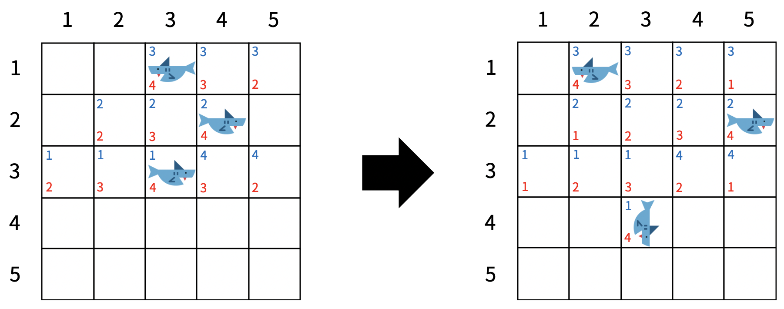
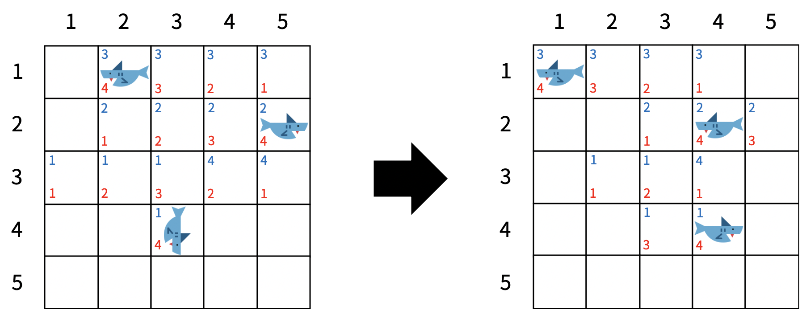

# 200709 19237 어른 상어

## 문제

[청소년 상어](https://www.acmicpc.net/problem/19236)는 더욱 자라 어른 상어가 되었다. 상어가 사는 공간에 더 이상 물고기는 오지 않고 다른 상어들만이 남아있다. 상어에는 1 이상 M 이하의 자연수 번호가 붙어 있고, 모든 번호는 서로 다르다. 상어들은 영역을 사수하기 위해 다른 상어들을 쫓아내려고 하는데, 1의 번호를 가진 어른 상어는 가장 강력해서 나머지 모두를 쫓아낼 수 있다.

N×N 크기의 격자 중 M개의 칸에 상어가 한 마리씩 들어 있다. 맨 처음에는 모든 상어가 자신의 위치에 자신의 냄새를 뿌린다. 그 후 1초마다 모든 상어가 동시에 상하좌우로 인접한 칸 중 하나로 이동하고, 자신의 냄새를 그 칸에 뿌린다. 냄새는 상어가 k번 이동하고 나면 사라진다.

각 상어가 이동 방향을 결정할 때는, 먼저 인접한 칸 중 아무 냄새가 없는 칸의 방향으로 잡는다. 그런 칸이 없으면 자신의 냄새가 있는 칸의 방향으로 잡는다. 이때 가능한 칸이 여러 개일 수 있는데, 그 경우에는 특정한 우선순위를 따른다. 우선순위는 상어마다 다를 수 있고, 같은 상어라도 현재 상어가 보고 있는 방향에 따라 또 다를 수 있다. 상어가 맨 처음에 보고 있는 방향은 입력으로 주어지고, 그 후에는 방금 이동한 방향이 보고 있는 방향이 된다.

모든 상어가 이동한 후 한 칸에 여러 마리의 상어가 남아 있으면, 가장 작은 번호를 가진 상어를 제외하고 모두 격자 밖으로 쫓겨난다.



<그림 1>

| 우선 순위 |         |        |         |      |         |      |         |
| :-------: | :-----: | :----: | :-----: | ---- | ------- | ---- | ------- |
|  상어 1   | 상어 2  | 상어 3 | 상어 4  |      |         |      |         |
|     ↑     | ↓ ← ↑ → |   ↑    | ↓ → ← ↑ | ↑    | → ← ↓ ↑ | ↑    | ← → ↑ ↓ |
|     ↓     | → ↑ ↓ ← |   ↓    | ↓ ↑ ← → | ↓    | ↑ → ← ↓ | ↓    | ← ↓ → ↑ |
|     ←     | ← → ↓ ↑ |   ←    | ← → ↑ ↓ | ←    | ↑ ← ↓ → | ←    | ↑ → ↓ ← |
|     →     | → ← ↑ ↓ |   →    | → ↑ ↓ ← | →    | ← ↓ ↑ → | →    | ↑ → ↓ ← |

<표 1>

<그림 1>은 맨 처음에 모든 상어가 자신의 냄새를 뿌린 상태를 나타내며, <표 1>에는 각 상어 및 현재 방향에 따른 우선순위가 표시되어 있다. 이 예제에서는 k = 4이다. 왼쪽 하단에 적힌 정수는 냄새를 의미하고, 그 값은 사라지기까지 남은 시간이다. 좌측 상단에 적힌 정수는 상어의 번호 또는 냄새를 뿌린 상어의 번호를 의미한다.



<그림 2>



<그림 3>

<그림 2>는 모든 상어가 한 칸 이동하고 자신의 냄새를 뿌린 상태이고, <그림 3>은 <그림 2>의 상태에서 한 칸 더 이동한 것이다. (2, 4)에는 상어 2과 4가 같이 도달했기 때문에, 상어 4는 격자 밖으로 쫓겨났다.



<그림 4>



<그림 5>

<그림 4>은 격자에 남아있는 모든 상어가 한 칸 이동하고 자신의 냄새를 뿌린 상태, <그림 5>는 <그림 4>에서 한 칸 더 이동한 상태를 나타낸다. 상어 2는 인접한 칸 중에 아무 냄새도 없는 칸이 없으므로 자신의 냄새가 들어있는 (2, 4)으로 이동했다. 상어가 이동한 후에, 맨 처음에 각 상어가 뿌린 냄새는 사라졌다.

이 과정을 반복할 때, 1번 상어만 격자에 남게 되기까지 몇 초가 걸리는지를 구하는 프로그램을 작성하시오.

## 입력

첫 줄에는 N, M, k가 주어진다. (2 ≤ N ≤ 20, 2 ≤ M ≤ N2, 1 ≤ k ≤ 1,000)

그 다음 줄부터 N개의 줄에 걸쳐 격자의 모습이 주어진다. 0은 빈칸이고, 0이 아닌 수 x는 x번 상어가 들어있는 칸을 의미한다.

그 다음 줄에는 각 상어의 방향이 차례대로 주어진다. 1, 2, 3, 4는 각각 위, 아래, 왼쪽, 오른쪽을 의미한다.

그 다음 줄부터 각 상어의 방향 우선순위가 상어 당 4줄씩 차례대로 주어진다. 각 줄은 4개의 수로 이루어져 있다. 하나의 상어를 나타내는 네 줄 중 첫 번째 줄은 해당 상어가 위를 향할 때의 방향 우선순위, 두 번째 줄은 아래를 향할 때의 우선순위, 세 번째 줄은 왼쪽을 향할 때의 우선순위, 네 번째 줄은 오른쪽을 향할 때의 우선순위이다. 각 우선순위에는 1부터 4까지의 자연수가 한 번씩 나타난다. 가장 먼저 나오는 방향이 최우선이다. 예를 들어, 우선순위가 1 3 2 4라면, 방향의 순서는 위, 왼쪽, 아래, 오른쪽이다.

맨 처음에는 각 상어마다 인접한 빈 칸이 존재한다. 따라서 처음부터 이동을 못 하는 경우는 없다.

## 출력

1번 상어만 격자에 남게 되기까지 걸리는 시간을 출력한다. 단, 1,000초가 넘어도 다른 상어가 격자에 남아 있으면 -1을 출력한다.

## 예제 입력 1 복사

```
5 4 4
0 0 0 0 3
0 2 0 0 0
1 0 0 0 4
0 0 0 0 0
0 0 0 0 0
4 4 3 1
2 3 1 4
4 1 2 3
3 4 2 1
4 3 1 2
2 4 3 1
2 1 3 4
3 4 1 2
4 1 2 3
4 3 2 1
1 4 3 2
1 3 2 4
3 2 1 4
3 4 1 2
3 2 4 1
1 4 2 3
1 4 2 3
```

## 예제 출력 1 복사

```
14
```

문제에 나온 그림과 같다.

## 예제 입력 2 복사

```
4 2 6
1 0 0 0
0 0 0 0
0 0 0 0
0 0 0 2
4 3
1 2 3 4
2 3 4 1
3 4 1 2
4 1 2 3
1 2 3 4
2 3 4 1
3 4 1 2
4 1 2 3
```

## 예제 출력 2 복사

```
26
```

## 예제 입력 3 복사

```
5 4 1
0 0 0 0 3
0 2 0 0 0
1 0 0 0 4
0 0 0 0 0
0 0 0 0 0
4 4 3 1
2 3 1 4
4 1 2 3
3 4 2 1
4 3 1 2
2 4 3 1
2 1 3 4
3 4 1 2
4 1 2 3
4 3 2 1
1 4 3 2
1 3 2 4
3 2 1 4
3 4 1 2
3 2 4 1
1 4 2 3
1 4 2 3
```

## 예제 출력 3 복사

```
-1
```

## 예제 입력 4 복사

```
5 4 10
0 0 0 0 3
0 0 0 0 0
1 2 0 0 0
0 0 0 0 4
0 0 0 0 0
4 4 3 1
2 3 1 4
4 1 2 3
3 4 2 1
4 3 1 2
2 4 3 1
2 1 3 4
3 4 1 2
4 1 2 3
4 3 2 1
1 4 3 2
1 3 2 4
3 2 1 4
3 4 1 2
3 2 4 1
1 4 2 3
1 4 2 3
```

## 예제 출력 4 복사

```
-1
```

## 출처

- 문제를 만든 사람: [baekjoon](https://www.acmicpc.net/user/baekjoon)

## Code

---

```python
import sys; input = sys.stdin.readline


def check(x, y, s_dir):
    global ocean, smell, priority, di, dj
    cx, cy, ck, mx, my, mk = 0, 0, 0, 0, 0, 0
    possible_smell = []
    possible_me = []
    cnt, me = 0, 0
    for k in range(1, 5):
        nx = x + di[k]
        ny = y + dj[k]
        if 0 <= nx < N and 0 <= ny < N:
            if not smell[nx][ny]:
                cnt += 1
                possible_smell.append(k)
                cx, cy, ck = nx, ny, k
            elif ocean[nx][ny] == ocean[x][y]:
                me += 1
                mx, my, mk = nx, ny, k
                possible_me.append(k)

    if cnt == 1:
        # 아무도 없는 칸
        return cx, cy, ck
    elif not cnt and me == 1:
        # 기존 본인 방향
        return mx, my, mk
    else:
        # 우선순위
        arr = priority[ocean[x][y]][s_dir-1]
        for idx in arr:
            if idx in possible_smell:
                return x+di[idx], y+dj[idx], idx

        for idx in arr:
            if idx in possible_me:
                return x+di[idx], y+dj[idx], idx


# base setting
N, M, k = map(int, input().split())
ocean = [list(map(int, input().split())) for _ in range(N)]
# 냄새 저장
smell = [[0] * N for _ in range(N)]
# 상어 좌표, 방향 저장
shark_info = {i+1: [] for i in range(M)}
answer = -1
for i in range(N):
    for j in range(N):
        if ocean[i][j]:
            shark_info[ocean[i][j]].append(i)
            shark_info[ocean[i][j]].append(j)
            smell[i][j] = k
shark_dir = list(map(int, input().split()))
for i in range(M):
    shark_info[i+1].append(shark_dir[i])
# 우선순위 정보 저장
priority = {i+1: [] for i in range(M)}
for num in priority:
    for _ in range(4):
        priority[num].append(list(map(int, input().split())))
di = [0, -1, 1, 0, 0] # 위, 아래, 왼쪽, 오른쪽
dj = [0, 0, 0, -1, 1]

time = 0
while time < 1000:
    time += 1
    tmp = [[0] * N for _ in range(N)]
    for key, value in shark_info.items():
        if value:
          	# 상어 정보 꺼내기
            si, sj, s_dir = value
            x, y, dir_ = check(si, sj, s_dir)
            if tmp[x][y]:
              shark_info[key] = 0
              else:
                tmp[x][y] = ocean[si][sj]
                value[0], value[1], value[2] = x, y, dir_
    shark = 0
    for i in range(N):
        for j in range(N):
            if smell[i][j]:
                smell[i][j] -= 1
                if not smell[i][j]:
                    ocean[i][j] = 0
            if tmp[i][j]:
                smell[i][j] = k
                ocean[i][j] = tmp[i][j]
                shark += 1
    if shark == 1:
        answer = time
        break
print(answer)
```

