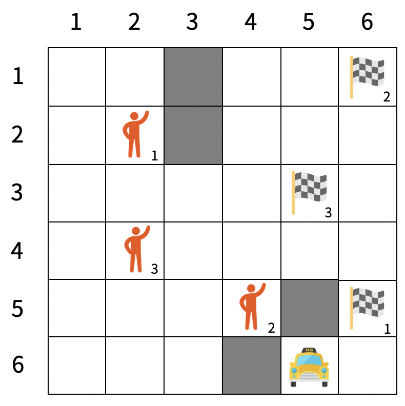
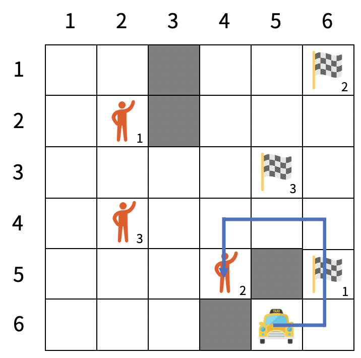
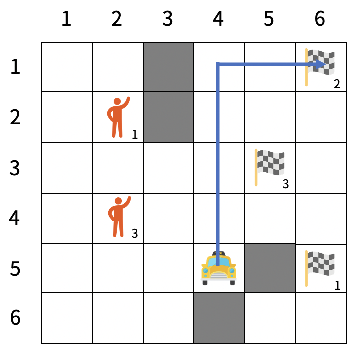
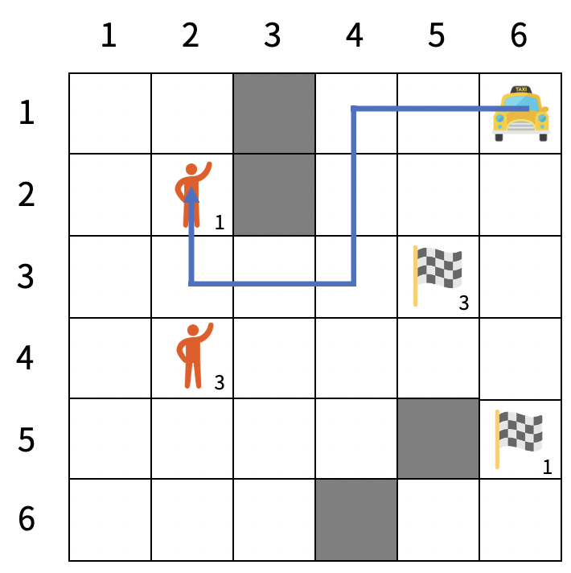
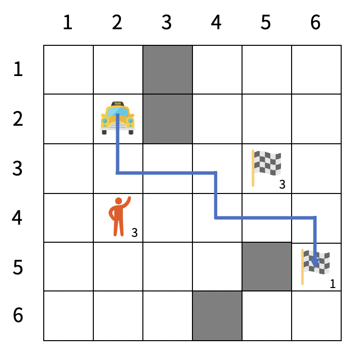
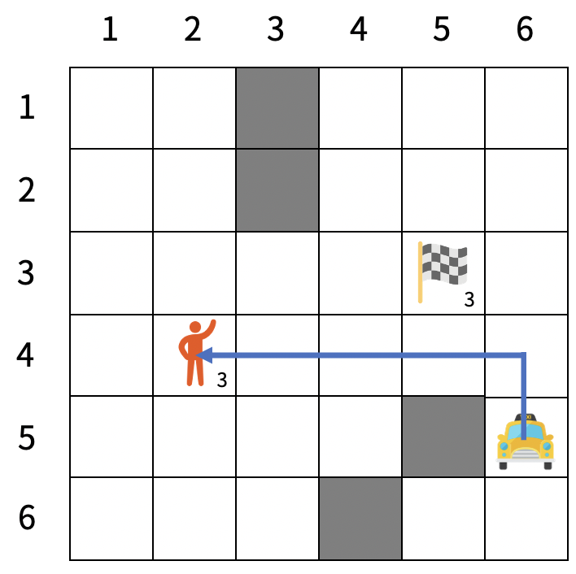
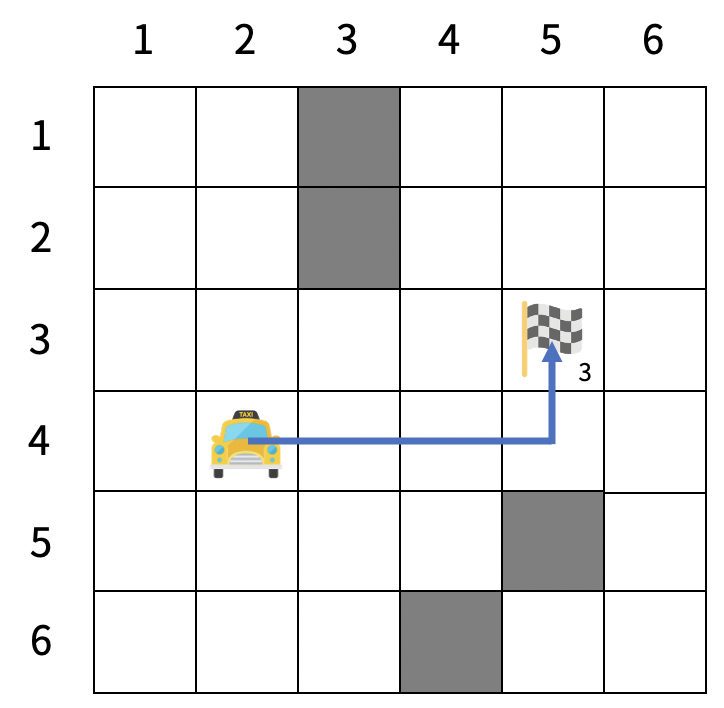

# 200711 19238 스타트 택시

## 문제

스타트링크가 "스타트 택시"라는 이름의 택시 사업을 시작했다. 스타트 택시는 특이하게도 손님을 도착지로 데려다줄 때마다 연료가 충전되고, 연료가 바닥나면 그 날의 업무가 끝난다.

택시 기사 최백준은 오늘 M명의 승객을 태우는 것이 목표이다. 백준이 활동할 영역은 N×N 크기의 격자로 나타낼 수 있고, 각 칸은 비어 있거나 벽이 놓여 있다. 택시가 빈칸에 있을 때, 상하좌우로 인접한 빈칸 중 하나로 이동할 수 있다. 알고리즘 경력이 많은 백준은 특정 위치로 이동할 때 항상 최단경로로만 이동한다.

M명의 승객은 빈칸 중 하나에 서 있으며, 다른 빈칸 중 하나로 이동하려고 한다. 여러 승객이 같이 탑승하는 경우는 없다. 따라서 백준은 한 승객을 태워 목적지로 이동시키는 일을 M번 반복해야 한다. 각 승객은 스스로 움직이지 않으며, 출발지에서만 택시에 탈 수 있고, 목적지에서만 택시에서 내릴 수 있다.

백준이 태울 승객을 고를 때는 현재 위치에서 최단거리가 가장 짧은 승객을 고른다. 그런 승객이 여러 명이면 그중 행 번호가 가장 작은 승객을, 그런 승객도 여러 명이면 그중 열 번호가 가장 작은 승객을 고른다. 택시와 승객이 같은 위치에 서 있으면 그 승객까지의 최단거리는 0이다. 연료는 한 칸 이동할 때마다 1만큼 소모된다. 한 승객을 목적지로 성공적으로 이동시키면, 그 승객을 태워 이동하면서 소모한 연료 양의 두 배가 충전된다. 이동하는 도중에 연료가 바닥나면 이동에 실패하고, 그 날의 업무가 끝난다. 승객을 목적지로 이동시킨 동시에 연료가 바닥나는 경우는 실패한 것으로 간주하지 않는다.



<그림 1>

<그림 1>은 택시가 활동할 영역의 지도를 나타내며, 택시와 세 명의 승객의 출발지와 목적지가 표시되어 있다. 택시의 현재 연료 양은 15이다. 현재 택시에서 각 손님까지의 최단거리는 각각 9, 6, 7이므로, 택시는 2번 승객의 출발지로 이동한다.

| <그림 2> | <그림 3> |
| ---------------------------------------------------- | ---------------------------------------------------- |
|                                                      |                                                      |

<그림 2>는 택시가 2번 승객의 출발지로 가는 경로를, <그림 3>은 2번 승객의 출발지에서 목적지로 가는 경로를 나타낸다. 목적지로 이동할 때까지 소비한 연료는 6이고, 이동하고 나서 12가 충전되므로 남은 연료의 양은 15이다. 이제 택시에서 각 손님까지의 최단거리는 둘 다 7이므로, 택시는 둘 중 행 번호가 더 작은 1번 승객의 출발지로 이동한다.

| <그림 4> | <그림 5> |
| ---------------------------------------------------- | ---------------------------------------------------- |
|                                                      |                                                      |

<그림 4>와 <그림 5>는 택시가 1번 승객을 태워 목적지로 이동시키는 경로를 나타낸다. 남은 연료의 양은 15 - 7 - 7 + 7×2 = 15이다.

| <그림 6> | <그림 7> |
| ---------------------------------------------------- | ---------------------------------------------------- |
|                                                      |                                                      |

<그림 6>과 <그림 7>은 택시가 3번 승객을 태워 목적지로 이동시키는 경로를 나타낸다. 최종적으로 남은 연료의 양은 15 - 5 - 4 + 4×2 = 14이다.

모든 승객을 성공적으로 데려다줄 수 있는지 알아내고, 데려다줄 수 있을 경우 최종적으로 남는 연료의 양을 출력하는 프로그램을 작성하시오.

## 입력

첫 줄에 N, M, 그리고 초기 연료의 양이 주어진다. (2 ≤ N ≤ 20, 1 ≤ M ≤ N2, 1 ≤ 초기 연료 ≤ 500,000) 연료는 무한히 많이 담을 수 있기 때문에, 초기 연료의 양을 넘어서 충전될 수도 있다.

다음 줄부터 N개의 줄에 걸쳐 백준이 활동할 영역의 지도가 주어진다. 0은 빈칸, 1은 벽을 나타낸다.

다음 줄에는 백준이 운전을 시작하는 칸의 행 번호와 열 번호가 주어진다. 행과 열 번호는 1 이상 N 이하의 자연수이고, 운전을 시작하는 칸은 빈칸이다.

그다음 줄부터 M개의 줄에 걸쳐 각 승객의 출발지의 행과 열 번호, 그리고 목적지의 행과 열 번호가 주어진다. 모든 출발지와 목적지는 빈칸이고, 모든 출발지는 서로 다르며, 각 손님의 출발지와 목적지는 다르다.

## 출력

모든 손님을 이동시키고 연료를 충전했을 때 남은 연료의 양을 출력한다. 단, 이동 도중에 연료가 바닥나서 다음 출발지나 목적지로 이동할 수 없으면 -1을 출력한다. 모든 손님을 이동시킬 수 없는 경우에도 -1을 출력한다.

## 예제 입력 1 복사

```
6 3 15
0 0 1 0 0 0
0 0 1 0 0 0
0 0 0 0 0 0
0 0 0 0 0 0
0 0 0 0 1 0
0 0 0 1 0 0
6 5
2 2 5 6
5 4 1 6
4 2 3 5
```

## 예제 출력 1 복사

```
14
```

## 예제 입력 2 복사

```
6 3 13
0 0 1 0 0 0
0 0 1 0 0 0
0 0 0 0 0 0
0 0 0 0 0 0
0 0 0 0 1 0
0 0 0 1 0 0
6 5
2 2 5 6
5 4 1 6
4 2 3 5
```

## 예제 출력 2 복사

```
-1
```

## 예제 입력 3 복사

```
6 3 100
0 0 1 0 0 0
0 0 1 0 0 0
0 0 0 1 0 0
0 0 0 1 0 0
0 0 0 0 1 0
0 0 0 1 0 0
6 5
2 2 5 6
5 4 1 6
4 2 3 5
```

## 예제 출력 3 복사

```
-1
```

## 출처

- 문제를 만든 사람: [baekjoon](https://www.acmicpc.net/user/baekjoon)

## Code

---

```python
import sys; input = sys.stdin.readline
from collections import deque


def arrive_bfs(x, y, dest_x, dest_y, fuel):
    global di, dj, start
    q = deque()
    q.append((x, y, fuel, 0))
    visited = [[0] * N for _ in range(N)]
    visited[x][y] = 1
    while q:
        x_, y_, fuel_, dist = q.popleft()
        # 승객이 도착했으면, 소모한 연료*2+남은연료해서 return
        if x_ == dest_x and y_ == dest_y:
            return 1, x_, y_, fuel_+dist*2
        elif not fuel_:
            break

        for k in range(4):
            nx = x_ + di[k]
            ny = y_ + dj[k]
            if 0 <= nx < N and 0 <= ny < N and not visited[nx][ny] and start[nx][ny] != -1:
                visited[nx][ny] = 1
                q.append((nx, ny, fuel_-1, dist+1))
    return 0, 0, 0, 0

def start_bfs(x, y, fuel):
    global di, dj, start
    q = deque()
    q.append((x, y, 0))
    visited = [[0] * N for _ in range(N)]
    visited[x][y] = 1
    minV = 10**8
    tmp = []
    while q:
        x_, y_, dist = q.popleft()
        # 연료가 떨어졌으면 종료
        if not fuel-dist: break
				# 태울 승객이 있고, dist가 현재 최소거리보다 작거나 같을 경우
        if start[x_][y_] >= 1 and minV >= dist:
          	# 최소 거리가 dist보다 작으면 최소 거리 갱신
            if minV > dist:
                minV = dist
            # dist, x, y, 값 tmp에 저장 -> 같을 경우 비교하기 위해
            tmp.append((dist, x_, y_))

        for k in range(4):
            nx = x_ + di[k]
            ny = y_ + dj[k]
            if 0 <= nx < N and 0 <= ny < N and not visited[nx][ny] and start[nx][ny] != -1:
                visited[nx][ny] = 1
                q.append((nx, ny, dist+1))
    if tmp:
      	# dist, x, y 순서대로 오름차순으로 정렬
        tmp = sorted(tmp, key=lambda x: (x[0], x[1], x[2]))
        # 배열의 맨 앞 값 x, y, 남은 연료 순서대로 return
        return tmp[0][1], tmp[0][2], fuel-tmp[0][0]
    return 0, 0, 0


N, M, fuel = map(int, input().split())
start = [list(map(int, input().split())) for _ in range(N)]
for i in range(N):
    for j in range(N):
      	# 벽을 -1로 만들어주기
        if start[i][j]:
            start[i][j] = -1
tx, ty = map(int, input().split())
tx -= 1
ty -= 1
# 도착정보 저장할 dictionary
info = {}
for i in range(M):
    a, b, c, d = list(map(int, input().split()))
    start[a-1][b-1] = i+1
    info[i+1] = [c-1, d-1]

di = [-1, 0, 0, 1]
dj = [0, -1, 1, 0]

answer = -1
cnt = 0
for _ in range(M):
  	# 택시 시작 위치와 연료를 bfs에 전달
    # 택시의 위치 return
    x, y, remain = start_bfs(tx, ty, fuel)
    # 남은 연료가 있는 경우
    if remain:
      	# 태운 승객
        pivot = start[x][y]
        # 승객 도착 정보
        arr = info[pivot]
        # 태운 승객 수
        cnt += 1
        # 기존 배열에서 0으로 태운 표시해주기
        start[x][y] = 0
        # 도착점 정보와 남은 연료를 도착 bfs에 전달
        flag, ax, ay, remain_fuel = arrive_bfs(x, y, arr[0], arr[1], remain)
        # 도착을 했다면
        if flag:
          	# 태운 승객 수와 태울 승객 수가 동일하다면
            if cnt == M:
              	# answer 갱신
                answer = remain_fuel
            # 택시 시작 정보 및 연료 갱신
            tx, ty, fuel = ax, ay, remain_fuel
        # 도착을 못하고 연료가 떨어졌다면
        else:
            break
    # 도착을 못하고 연료가 떨어졌다면
    else:
        break
print(answer)
```

