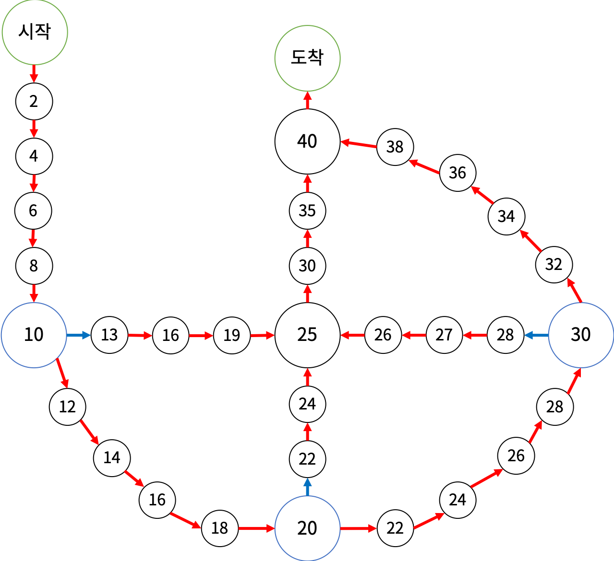

# 200718 17825 주사위 윷놀이

## 문제

주사위 윷놀이는 다음과 같은 게임판에서 하는 게임이다.



- 처음에는 시작 칸에 말 4개가 있다.
- 말은 게임판에 그려진 화살표의 방향대로만 이동할 수 있다. 말이 파란색 칸에서 이동을 시작하면 파란색 화살표를 타야 하고, 이동하는 도중이거나 파란색이 아닌 칸에서 이동을 시작하면 빨간색 화살표를 타야 한다. 말이 도착 칸으로 이동하면 주사위에 나온 수와 관계 없이 이동을 마친다.
- 게임은 10개의 턴으로 이루어진다. 매 턴마다 1부터 5까지 한 면에 하나씩 적혀있는 5면체 주사위를 굴리고, 도착 칸에 있지 않은 말을 하나 골라 주사위에 나온 수만큼 이동시킨다.
- 말이 이동을 마치는 칸에 다른 말이 있으면 그 말은 고를 수 없다. 단, 이동을 마치는 칸이 도착 칸이면 고를 수 있다.
- 말이 이동을 마칠 때마다 칸에 적혀있는 수가 점수에 추가된다.

주사위에서 나올 수 10개를 미리 알고 있을 때, 얻을 수 있는 점수의 최댓값을 구해보자.

## 입력

첫째 줄에 주사위에서 나올 수 10개가 순서대로 주어진다.

## 출력

얻을 수 있는 점수의 최댓값을 출력한다.

## 예제 입력 1 복사

```
1 2 3 4 1 2 3 4 1 2
```

## 예제 출력 1 복사

```
190
```

## 예제 입력 2 복사

```
1 1 1 1 1 1 1 1 1 1
```

## 예제 출력 2 복사

```
133
```

## 예제 입력 3 복사

```
5 1 2 3 4 5 5 3 2 4
```

## 예제 출력 3 복사

```
214
```

## 예제 입력 4 복사

```
5 5 5 5 5 5 5 5 5 5
```

## 예제 출력 4 복사

```
130
```

## 출처

- 문제를 만든 사람: [baekjoon](https://www.acmicpc.net/user/baekjoon)
- 문제를 다시 작성한 사람: [jh05013](https://www.acmicpc.net/user/jh05013)

## Code

---

```python
import sys; input = sys.stdin.readline


def dfs(idx, cnt, total, horses):
    global maxV, turn, end
    if cnt == turn:
        maxV = max(total, maxV)
        return
    else:
        h_tmp = horses[:]
        h_tmp[idx] = move[h_tmp[idx]][move_info[cnt]-1]
        total += score_info[h_tmp[idx]]
        for i in range(4):
            if h_tmp[i] == end: continue
            if cnt+1 < turn:
                next_move = move_info[cnt+1]-1
                if move[h_tmp[i]][next_move] != end and move[h_tmp[i]][next_move] in h_tmp: continue
            dfs(i, cnt+1, total, h_tmp)


score_info = {}
for i in range(20):
    score_info[i] = i*2
tmp = [13, 16, 19, 22, 24, 28, 27, 26, 25, 30, 35, 40, 0]
for i in range(13):
    score_info[i+20] = tmp[i]

move = {
    0: [1, 2, 3, 4, 5],
    1: [2, 3, 4, 5, 6],
    2: [3, 4, 5, 6, 7],
    3: [4, 5, 6, 7, 8],
    4: [5, 6, 7, 8, 9],
    5: [20, 21, 22, 28, 29],
    6: [7, 8, 9, 10, 11],
    7: [8, 9, 10, 11, 12],
    8: [9, 10, 11, 12, 13],
    9: [10, 11, 12, 13, 14],
    10: [23, 24, 28, 29, 30],
    11: [12, 13, 14, 15, 16],
    12: [13, 14, 15, 16, 17],
    13: [14, 15, 16, 17, 18],
    14: [15, 16, 17, 18, 19],
    15: [25, 26, 27, 28, 29],
    16: [17, 18, 19, 31, 32],
    17: [18, 19, 31, 32, 32],
    18: [19, 31, 32, 32, 32],
    19: [31, 32, 32, 32, 32],
    20: [21, 22, 28, 29, 30],
    21: [22, 28, 29, 30, 31],
    22: [28, 29, 30, 31, 32],
    23: [24, 28, 29, 30, 31],
    24: [28, 29, 30, 31, 32],
    25: [26, 27, 28, 29, 30],
    26: [27, 28, 29, 30, 31],
    27: [28, 29, 30, 31, 32],
    28: [29, 30, 31, 32, 32],
    29: [30, 31, 32, 32, 32],
    30: [31, 32, 32, 32, 32],
    31: [32, 32, 32, 32, 32]
}

move_info = list(map(int, input().split()))
horses = [0, 0, 0, 0]
turn = 10
end = 32
maxV = 0
dfs(0, 0, 0, horses)
print(maxV)


# 5: 10
# score_info[20] = 13
# score_info[21] = 16
# score_info[22] = 19
# 10: 20
# score_info[23] = 22
# score_info[24] = 24
# 15: 30
# score_info[25] = 28
# score_info[26] = 27
# score_info[27] = 26
# 28 :25
# score_info[28] = 25
# score_info[29] = 30
# score_info[30] = 35
# end
# score_info[31] = 40
# score_info[32] = 0
```

