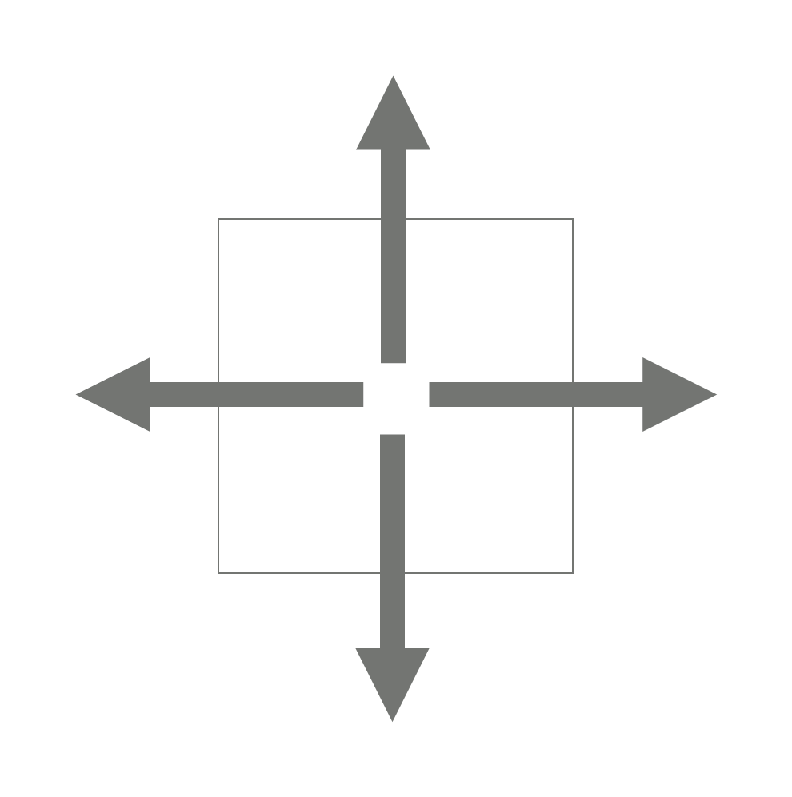

# 200726 15683 감시

## 문제

스타트링크의 사무실은 1×1크기의 정사각형으로 나누어져 있는 N×M 크기의 직사각형으로 나타낼 수 있다. 사무실에는 총 K개의 CCTV가 설치되어져 있는데, CCTV는 5가지 종류가 있다. 각 CCTV가 감시할 수 있는 방법은 다음과 같다.

|  |  |  |  |  |
| -------------------------------------- | -------------------------------------- | ---------------------------- | -------------------------------------- | -------------------------------------- |
| 1번                                    | 2번                                    | 3번                          | 4번                                    | 5번                                    |

1번 CCTV는 한 쪽 방향만 감시할 수 있다. 2번과 3번은 두 방향을 감시할 수 있는데, 2번은 감시하는 방향이 서로 반대방향이어야 하고, 3번은 직각 방향이어야 한다. 4번은 세 방향, 5번은 네 방향을 감시할 수 있다.

CCTV는 감시할 수 있는 방향에 있는 칸 전체를 감시할 수 있다. 사무실에는 벽이 있는데, CCTV는 벽을 통과할 수 없다. CCTV가 감시할 수 없는 영역은 사각지대라고 한다.

CCTV는 회전시킬 수 있는데, 회전은 항상 90도 방향으로 해야 하며, 감시하려고 하는 방향이 가로 또는 세로 방향이어야 한다.

```
0 0 0 0 0 0
0 0 0 0 0 0
0 0 1 0 6 0
0 0 0 0 0 0
```

지도에서 0은 빈 칸, 6은 벽, 1~5는 CCTV의 번호이다. 위의 예시에서 1번의 방향에 따라 감시할 수 있는 영역을 '`#`'로 나타내면 아래와 같다.

| `0 0 0 0 0 0 0 0 0 0 0 0 0 0 1 # 6 0 0 0 0 0 0 0` | `0 0 0 0 0 0 0 0 0 0 0 0 # # 1 0 6 0 0 0 0 0 0 0` | `0 0 # 0 0 0 0 0 # 0 0 0 0 0 1 0 6 0 0 0 0 0 0 0` | `0 0 0 0 0 0 0 0 0 0 0 0 0 0 1 0 6 0 0 0 # 0 0 0` |
| ------------------------------------------------- | ------------------------------------------------- | ------------------------------------------------- | ------------------------------------------------- |
| →                                                 | ←                                                 | ↑                                                 | ↓                                                 |

CCTV는 벽을 통과할 수 없기 때문에, 1번이 → 방향을 감시하고 있을 때는 6의 오른쪽에 있는 벽을 감시할 수 없다.

```
0 0 0 0 0 0
0 2 0 0 0 0
0 0 0 0 6 0
0 6 0 0 2 0
0 0 0 0 0 0
0 0 0 0 0 5
```

위의 예시에서 감시할 수 있는 방향을 알아보면 아래와 같다.

| `0 0 0 0 0 # # 2 # # # # 0 0 0 0 6 # 0 6 # # 2 # 0 0 0 0 0 # # # # # # 5` | `0 0 0 0 0 # # 2 # # # # 0 0 0 0 6 # 0 6 0 0 2 # 0 0 0 0 # # # # # # # 5` | `0 # 0 0 0 # 0 2 0 0 0 # 0 # 0 0 6 # 0 6 # # 2 # 0 0 0 0 0 # # # # # # 5` | `0 # 0 0 0 # 0 2 0 0 0 # 0 # 0 0 6 # 0 6 0 0 2 # 0 0 0 0 # # # # # # # 5` |
| ------------------------------------------------------------ | ------------------------------------------------------------ | ------------------------------------------------------------ | ------------------------------------------------------------ |
| 왼쪽 상단 2: ↔, 오른쪽 하단 2: ↔                             | 왼쪽 상단 2: ↔, 오른쪽 하단 2: ↕                             | 왼쪽 상단 2: ↕, 오른쪽 하단 2: ↔                             | 왼쪽 상단 2: ↕, 오른쪽 하단 2: ↕                             |

CCTV는 CCTV를 통과할 수 있다. 아래 예시를 보자.

```
0 0 2 0 3
0 6 0 0 0
0 0 6 6 0
0 0 0 0 0
```

위와 같은 경우에 2의 방향이 ↕ 3의 방향이 ←와 ↓인 경우 감시받는 영역은 다음과 같다.

```
# # 2 # 3
0 6 # 0 #
0 0 6 6 #
0 0 0 0 #
```

사무실의 크기와 상태, 그리고 CCTV의 정보가 주어졌을 때, CCTV의 방향을 적절히 정해서, 사각 지대의 최소 크기를 구하는 프로그램을 작성하시오.

## 입력

첫째 줄에 사무실의 세로 크기 N과 가로 크기 M이 주어진다. (1 ≤ N, M ≤ 8)

둘째 줄부터 N개의 줄에는 사무실 각 칸의 정보가 주어진다. 0은 빈 칸, 6은 벽, 1~5는 CCTV를 나타내고, 문제에서 설명한 CCTV의 종류이다. 

CCTV의 최대 개수는 8개를 넘지 않는다.

## 출력

첫째 줄에 사각 지대의 최소 크기를 출력한다.

## 예제 입력 1 복사

```
4 6
0 0 0 0 0 0
0 0 0 0 0 0
0 0 1 0 6 0
0 0 0 0 0 0
```

## 예제 출력 1 복사

```
20
```

## 예제 입력 2 복사

```
6 6
0 0 0 0 0 0
0 2 0 0 0 0
0 0 0 0 6 0
0 6 0 0 2 0
0 0 0 0 0 0
0 0 0 0 0 5
```

## 예제 출력 2 복사

```
15
```

## 예제 입력 3 복사

```
6 6
1 0 0 0 0 0
0 1 0 0 0 0
0 0 1 0 0 0
0 0 0 1 0 0
0 0 0 0 1 0
0 0 0 0 0 1
```

## 예제 출력 3 복사

```
6
```

## 예제 입력 4 복사

```
6 6
1 0 0 0 0 0
0 1 0 0 0 0
0 0 1 5 0 0
0 0 5 1 0 0
0 0 0 0 1 0
0 0 0 0 0 1
```

## 예제 출력 4 복사

```
2
```

## 예제 입력 5 복사

```
1 7
0 1 2 3 4 5 6
```

## 예제 출력 5 복사

```
0
```

## 예제 입력 6 복사

```
3 7
4 0 0 0 0 0 0
0 0 0 2 0 0 0
0 0 0 0 0 0 4
```

## 예제 출력 6 복사

```
0
```

## 출처

- 문제를 만든 사람: [baekjoon](https://www.acmicpc.net/user/baekjoon)

## 알고리즘 분류

- [브루트 포스](https://www.acmicpc.net/problem/tag/브루트 포스)

## Code

---

```python
import sys; input = sys.stdin.readline


def fill(x, y, k, c):
    global visited
    while True:
        x += di[k]
        y += dj[k]
        # 범위 안이고 벽이 아니면
        if 0 <= x < N and 0 <= y < M and office[x][y] != 6:
            # 감시가 되지 않는 영역이라면
            if not office[x][y]:
                visited[x][y] += c
            else: continue
        else:
            break

def check(x, y, arr, c):
    for k in arr:
        fill(x, y, k, c)

def dfs(idx, cctv_cnt):
    global cctv_info, answer
    if idx == cctv_cnt:
        # cctv를 전부 찾으면
        tmp = 0
        for i in range(N):
            for j in range(M):
                if not visited[i][j]:
                    tmp += 1
        answer = min(tmp, answer)
    else:
        x, y, cctv = cctv_info[idx]
        # visited를 1로 표시하고 -> 재귀 -> 1 지우기
        for arr in move[cctv]:
            check(x, y, arr, 1)
            dfs(idx+1, cctv_cnt)
            check(x, y, arr, -1)


N, M = map(int, input().split())
office = [list(map(int, input().split())) for _ in range(N)]
# cctv 감시 및 벽 표시 배열
visited = [[0] * M for _ in range(N)]
cctv_info = []
answer = 10**9
# 각 경우마다 가능한 방향 정해놓기
move = {
    1: [[0], [1], [2], [3]],
    2: [[0, 2], [1, 3]],
    3: [[0, 1], [1, 2], [2, 3], [3, 0]],
    4: [[0, 1, 2], [1, 2, 3], [2, 3, 0], [3, 0, 1]]
}
di = [0, 1, 0, -1]
dj = [1, 0, -1, 0]

# 배열을 탐색하며, 벽, cctv에 대한 정보 저장하기
for i in range(N):
    for j in range(M):
        if office[i][j]:
            # 우선 5일때는 한가지 경우 밖에 없기 때문에, 상하좌우를 채우고 시작
            if office[i][j] == 5:
                for k in range(4):
                    fill(i, j, k, 1)
            # 나머지 cctv 정보 저장
            elif 1 <= office[i][j] < 5:
                cctv_info.append((i, j, office[i][j]))
            # 종류에 상관없이 1로 표시
            visited[i][j] += 1
dfs(0, len(cctv_info))
print(answer)
```

