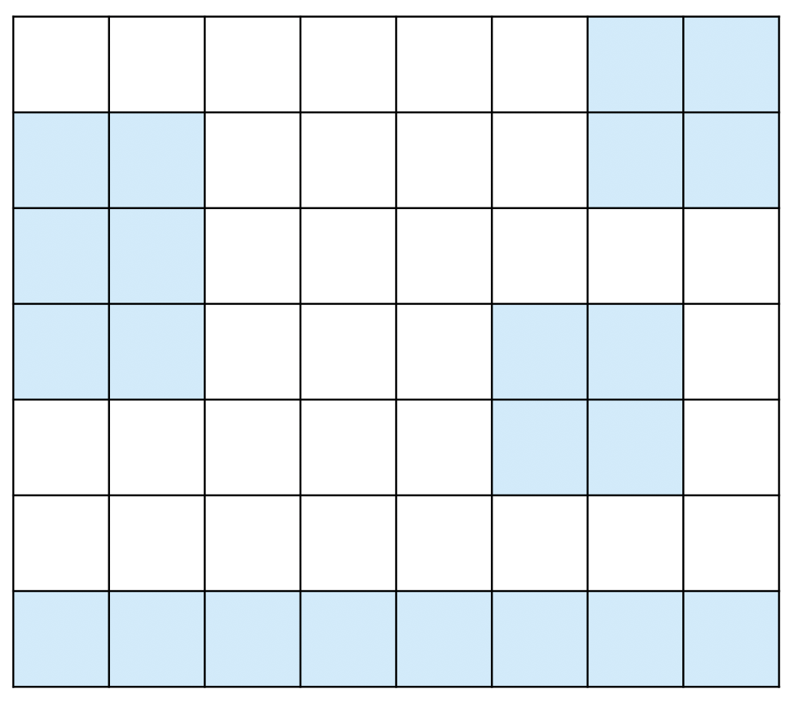
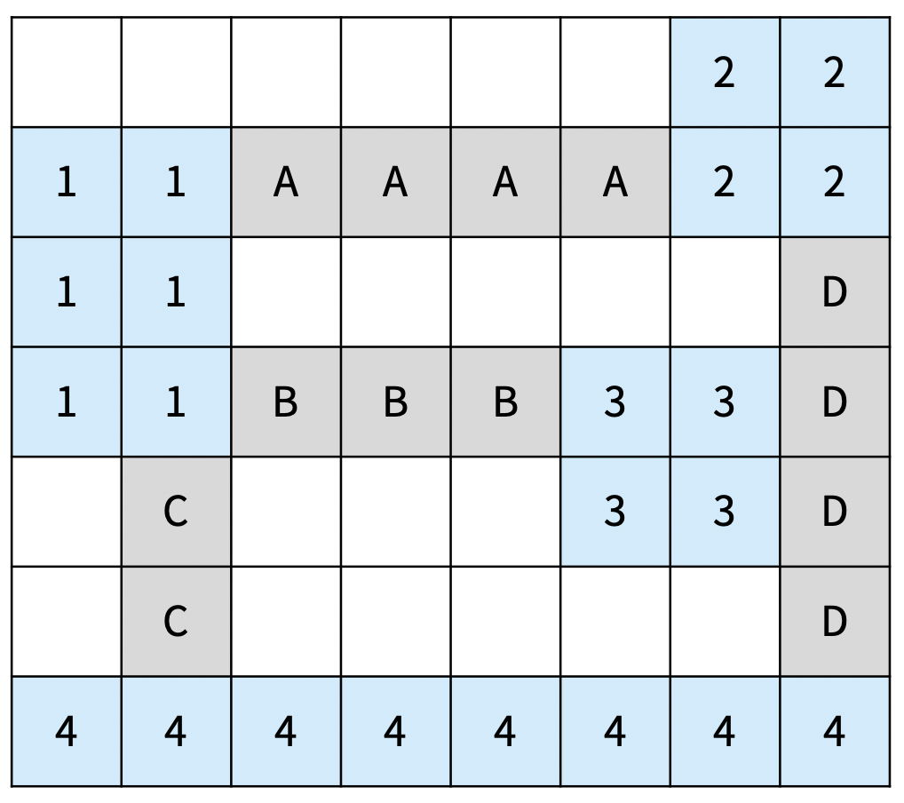
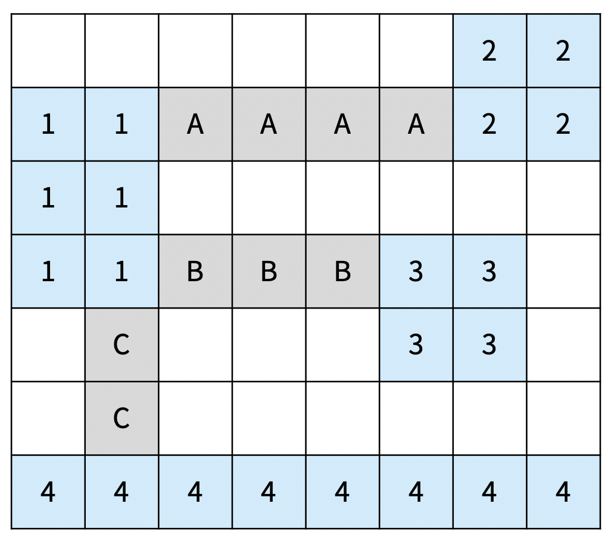
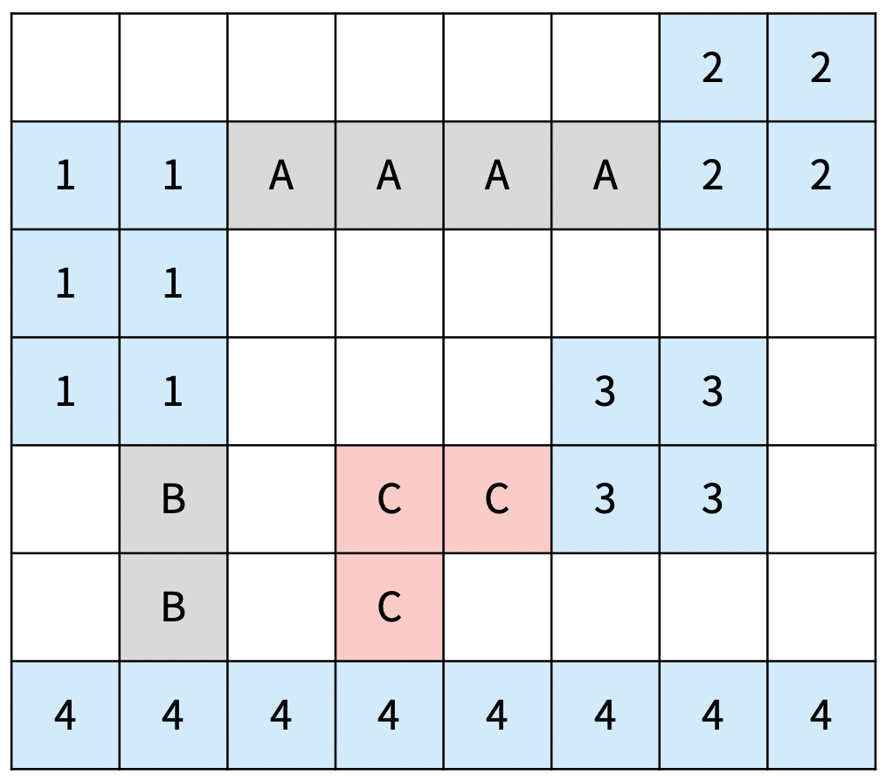
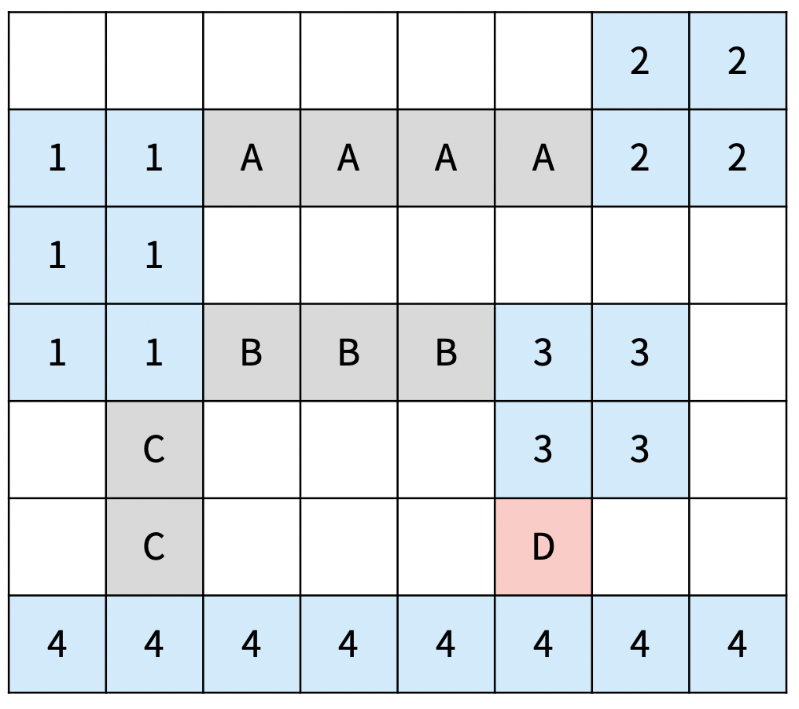
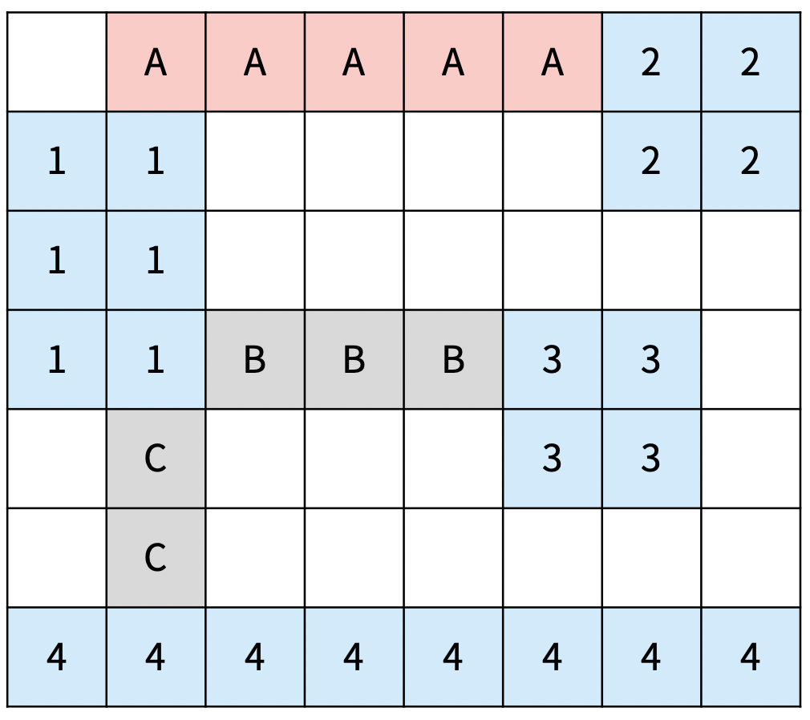
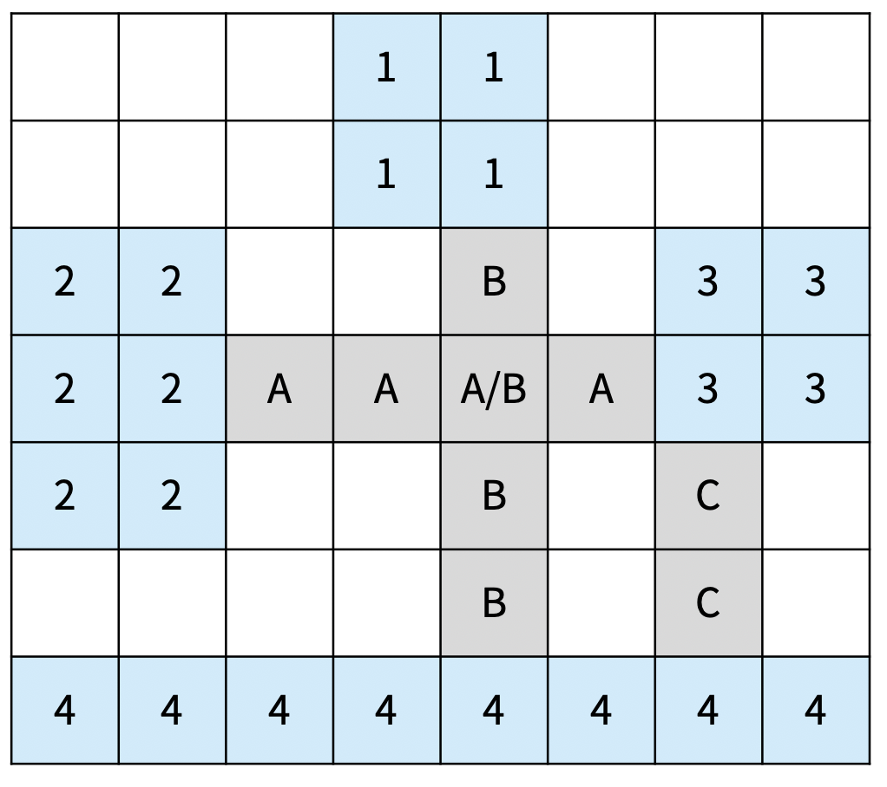
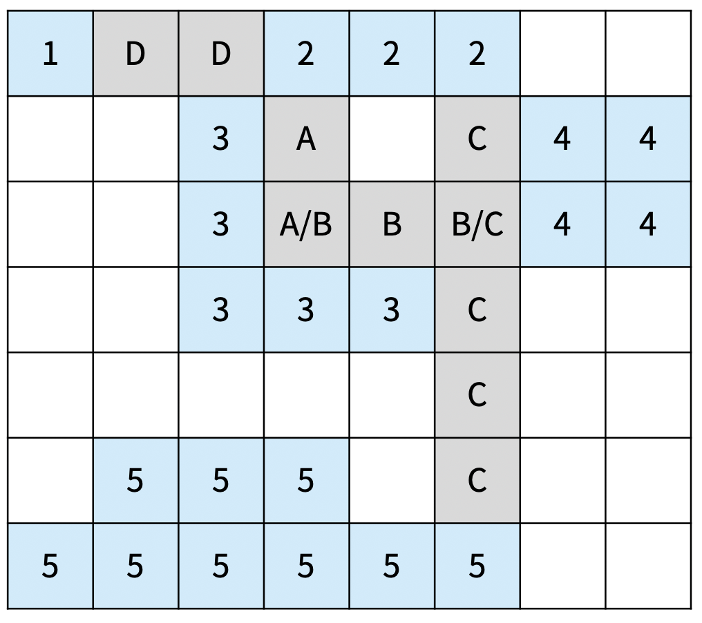

# 200808 17472 다리 만들기2

## 문제

섬으로 이루어진 나라가 있고, 모든 섬을 다리로 연결하려고 한다. 이 나라의 지도는 N×M 크기의 이차원 격자로 나타낼 수 있고, 격자의 각 칸은 땅이거나 바다이다.

섬은 연결된 땅이 상하좌우로 붙어있는 덩어리를 말하고, 아래 그림은 네 개의 섬으로 이루어진 나라이다. 색칠되어있는 칸은 땅이다.



다리는 바다에만 건설할 수 있고, 다리의 길이는 다리가 격자에서 차지하는 칸의 수이다. 다리를 연결해서 모든 섬을 연결하려고 한다. 섬 A에서 다리를 통해 섬 B로 갈 수 있을 때, 섬 A와 B를 연결되었다고 한다. 다리의 양 끝은 섬과 인접한 바다 위에 있어야 하고, 한 다리의 방향이 중간에 바뀌면 안된다. 또, 다리의 길이는 2 이상이어야 한다.

다리의 방향이 중간에 바뀌면 안되기 때문에, 다리의 방향은 가로 또는 세로가 될 수 밖에 없다. 방향이 가로인 다리는 다리의 양 끝이 가로 방향으로 섬과 인접해야 하고, 방향이 세로인 다리는 다리의 양 끝이 세로 방향으로 섬과 인접해야 한다.

섬 A와 B를 연결하는 다리가 중간에 섬 C와 인접한 바다를 지나가는 경우에 섬 C는 A, B와 연결되어있는 것이 아니다. 

아래 그림은 섬을 모두 연결하는 올바른 2가지 방법이고, 다리는 회색으로 색칠되어 있다. 섬은 정수, 다리는 알파벳 대문자로 구분했다.

|                  |  |
| ------------------------------------------------------------ | -------------------------------------------- |
| 다리의 총 길이: 13D는 2와 4를 연결하는 다리이고, 3과는 연결되어 있지 않다. | 다리의 총 길이: 9 (최소)                     |

다음은 올바르지 않은 3가지 방법이다

|  |  |    |
| -------------------------------------------- | -------------------------------------------- | ---------------------------------------------- |
| C의 방향이 중간에 바뀌었다                   | D의 길이가 1이다.                            | 가로 다리인 A가 1과 가로로 연결되어 있지 않다. |

다리가 교차하는 경우가 있을 수도 있다. 교차하는 다리의 길이를 계산할 때는 각 칸이 각 다리의 길이에 모두 포함되어야 한다. 아래는 다리가 교차하는 경우와 기타 다른 경우에 대한 2가지 예시이다.

|                  |                  |
| ------------------------------------------------------------ | ------------------------------------------------------------ |
| A의 길이는 4이고, B의 길이도 4이다.총 다리의 총 길이: 4 + 4 + 2 = 10 | 다리 A: 2와 3을 연결 (길이 2)다리 B: 3과 4를 연결 (길이 3)다리 C: 2와 5를 연결 (길이 5)다리 D: 1과 2를 연결 (길이 2)총 길이: 12 |

나라의 정보가 주어졌을 때, 모든 섬을 연결하는 다리 길이의 최솟값을 구해보자.

## 입력

첫째 줄에 지도의 세로 크기 N과 가로 크기 M이 주어진다. 둘째 줄부터 N개의 줄에 지도의 정보가 주어진다. 각 줄은 M개의 수로 이루어져 있으며, 수는 0 또는 1이다. 0은 바다, 1은 땅을 의미한다.

## 출력

모든 섬을 연결하는 다리 길이의 최솟값을 출력한다. 모든 섬을 연결하는 것이 불가능하면 -1을 출력한다.

## 제한

- 1 ≤ N, M ≤ 10
- 3 ≤ N×M ≤ 100
- 2 ≤ 섬의 개수 ≤ 6

## 예제 입력 1 복사

```
7 8
0 0 0 0 0 0 1 1
1 1 0 0 0 0 1 1
1 1 0 0 0 0 0 0
1 1 0 0 0 1 1 0
0 0 0 0 0 1 1 0
0 0 0 0 0 0 0 0
1 1 1 1 1 1 1 1
```

## 예제 출력 1 복사

```
9
```

## 예제 입력 2 복사

```
7 8
0 0 0 1 1 0 0 0
0 0 0 1 1 0 0 0
1 1 0 0 0 0 1 1
1 1 0 0 0 0 1 1
1 1 0 0 0 0 0 0
0 0 0 0 0 0 0 0
1 1 1 1 1 1 1 1
```

## 예제 출력 2 복사

```
10
```

## 예제 입력 3 복사

```
7 8
1 0 0 1 1 1 0 0
0 0 1 0 0 0 1 1
0 0 1 0 0 0 1 1
0 0 1 1 1 0 0 0
0 0 0 0 0 0 0 0
0 1 1 1 0 0 0 0
1 1 1 1 1 1 0 0
```

## 예제 출력 3 복사

```
9
```

## 예제 입력 4 복사

```
7 7
1 1 1 0 1 1 1
1 1 1 0 1 1 1
1 1 1 0 1 1 1
0 0 0 0 0 0 0
1 1 1 0 1 1 1
1 1 1 0 1 1 1
1 1 1 0 1 1 1
```

## 예제 출력 4 복사

```
-1
```

## 출처

- 문제를 만든 사람: [baekjoon](https://www.acmicpc.net/user/baekjoon)
- 데이터를 추가한 사람: [djm03178](https://www.acmicpc.net/user/djm03178)

## Code

---

```python
import sys; input = sys.stdin.readline
from collections import deque


def find_set(x, p):
    if x == p[x]:
        return x
    else:
        p[x] = find_set(p[x], p)
        return p[x]

def union(x, y, p):
    p[find_set(x, p)] = find_set(y, p)

def bfs(x, y, g):
    di = [0, 1, 0, -1]
    dj = [1, 0, -1, 0]
    q = deque()
    q.append((x, y))
    visited[x][y] = g
    while q:
        x_, y_ = q.popleft()
        for k in range(4):
            nx, ny = x_ + di[k], y_ + dj[k]
            if 0 <= nx < N and 0 <= ny < M and ocean[nx][ny] and not visited[nx][ny]:
                visited[nx][ny] = g
                q.append((nx, ny))


N, M = map(int, input().split())
ocean = [list(map(int, input().split())) for _ in range(N)]
visited = [[0] * M for _ in range(N)]
answer = -1
# grouping
group = 0
for i in range(N):
    for j in range(M):
        if ocean[i][j] and not visited[i][j]:
            group += 1
            bfs(i, j, group)
# adj list
adj = {i: [0] + [100] * group for i in range(1, group+1)}
# row
for i in range(N):
    j = 0
    one, two, flag = 0, 0, 0
    pivot = 0
    while j < M-1:
        if visited[i][j] and not visited[i][j+1]:
            one = visited[i][j]
            pivot = j
            flag = 1
        if flag and not visited[i][j] and visited[i][j+1]:
            two = visited[i][j+1]
            if abs(pivot-j) > 1 and adj[one][two] > abs(pivot-j):
                adj[one][two] = abs(pivot-j)
                adj[two][one] = abs(pivot-j)
            flag = 0
        j += 1
# column
for i in range(M):
    j = 0
    one, two, flag = 0, 0, 0
    pivot = 0
    while j < N-1:
        if visited[j][i] and not visited[j+1][i]:
            one = visited[j][i]
            pivot = j
            flag = 1
        if flag and not visited[j][i] and visited[j+1][i]:
            two = visited[j+1][i]
            if abs(pivot-j) > 1 and adj[one][two] > abs(pivot-j):
                adj[one][two] = abs(pivot-j)
                adj[two][one] = abs(pivot-j)
            flag = 0
        j += 1
# edge
edge = []
for i in range(1, group+1):
    for j in range(i+1, group+1):
        if adj[i][j] < 100:
            edge.append((adj[i][j], i, j))
edge.sort()
# kruskal
p = {i:i for i in range(1, group+1)}
chain, result = 0, 0
if len(edge) >= group-1:
    for minV, x, y in edge:
        if find_set(x, p) != find_set(y, p):
            union(x, y, p)
            chain += 1
            result += minV
            if chain == group-1:
                break
    if chain != group-1:
        answer = -1
    else:
        answer = result
print(answer)
```


