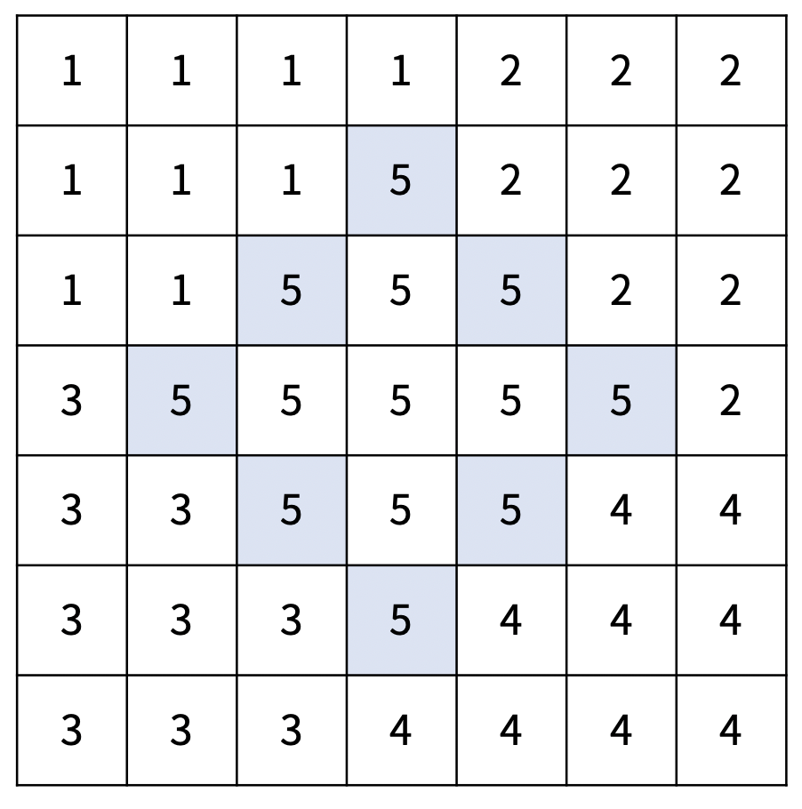
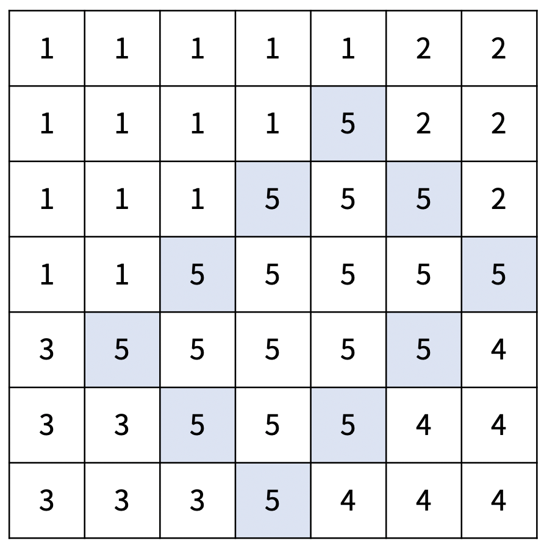
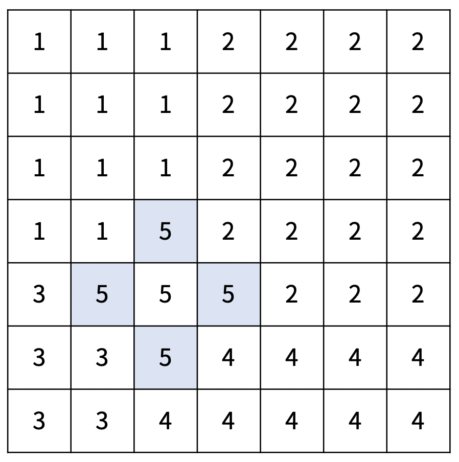
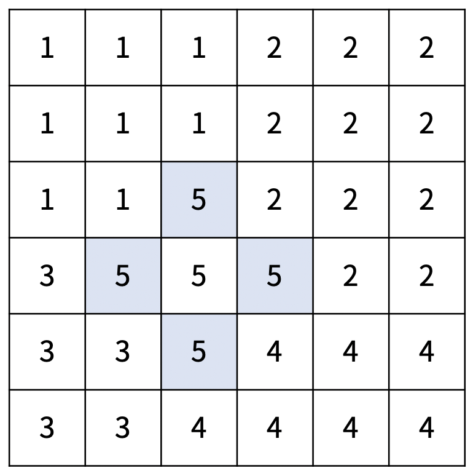
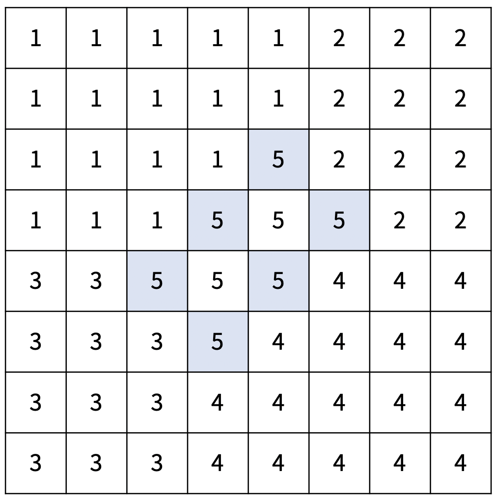

# 200809 17779 게리맨더링2

## 문제

재현시의 시장 구재현은 지난 몇 년간 게리맨더링을 통해서 자신의 당에게 유리하게 선거구를 획정했다. 견제할 권력이 없어진 구재현은 권력을 매우 부당하게 행사했고, 심지어는 시의 이름도 재현시로 변경했다. 이번 선거에서는 최대한 공평하게 선거구를 획정하려고 한다.

재현시는 크기가 N×N인 격자로 나타낼 수 있다. 격자의 각 칸은 구역을 의미하고, r행 c열에 있는 구역은 (r, c)로 나타낼 수 있다. 구역을 다섯 개의 선거구로 나눠야 하고, 각 구역은 다섯 선거구 중 하나에 포함되어야 한다. 선거구는 구역을 적어도 하나 포함해야 하고, 한 선거구에 포함되어 있는 구역은 모두 연결되어 있어야 한다. 구역 A에서 인접한 구역을 통해서 구역 B로 갈 수 있을 때, 두 구역은 연결되어 있다고 한다. 중간에 통하는 인접한 구역은 0개 이상이어야 하고, 모두 같은 선거구에 포함된 구역이어야 한다.

선거구를 나누는 방법은 다음과 같다.

1. 기준점 (x, y)와 경계의 길이 d1, d2를 정한다. (d1, d2 ≥ 1, 1 ≤ x < x+d1+d2 ≤ N, 1 ≤ y-d1 < y < y+d2 ≤ N)
2. 다음 칸은 경계선이다.
   1. (x, y), (x+1, y-1), ..., (x+d1, y-d1)
   2. (x, y), (x+1, y+1), ..., (x+d2, y+d2)
   3. (x+d1, y-d1), (x+d1+1, y-d1+1), ... (x+d1+d2, y-d1+d2)
   4. (x+d2, y+d2), (x+d2+1, y+d2-1), ..., (x+d2+d1, y+d2-d1)
3. 경계선과 경계선의 안에 포함되어있는 곳은 5번 선거구이다.
4. 5번 선거구에 포함되지 않은 구역 (r, c)의 선거구 번호는 다음 기준을 따른다.
   - 1번 선거구: 1 ≤ r < x+d1, 1 ≤ c ≤ y
   - 2번 선거구: 1 ≤ r ≤ x+d2, y < c ≤ N
   - 3번 선거구: x+d1 ≤ r ≤ N, 1 ≤ c < y-d1+d2
   - 4번 선거구: x+d2 < r ≤ N, y-d1+d2 ≤ c ≤ N

아래는 크기가 7×7인 재현시를 다섯 개의 선거구로 나눈 방법의 예시이다.

|  |  |  |
| -------------------------------------------- | -------------------------------------------- | -------------------------------------------- |
| x = 2, y = 4, d1 = 2, d2 = 2                 | x = 2, y = 5, d1 = 3, d2 = 2                 | x = 4, y = 3, d1 = 1, d2 = 1                 |

구역 (r, c)의 인구는 A[r][c]이고, 선거구의 인구는 선거구에 포함된 구역의 인구를 모두 합한 값이다. 선거구를 나누는 방법 중에서, 인구가 가장 많은 선거구와 가장 적은 선거구의 인구 차이의 최솟값을 구해보자.

## 입력

첫째 줄에 재현시의 크기 N이 주어진다.

둘째 줄부터 N개의 줄에 N개의 정수가 주어진다. r행 c열의 정수는 A[r][c]를 의미한다.

## 출력

첫째 줄에 인구가 가장 많은 선거구와 가장 적은 선거구의 인구 차이의 최솟값을 출력한다.

## 제한

- 5 ≤ N ≤ 20
- 1 ≤ A[r][c] ≤ 100

## 예제 입력 1 복사

```
6
1 2 3 4 1 6
7 8 9 1 4 2
2 3 4 1 1 3
6 6 6 6 9 4
9 1 9 1 9 5
1 1 1 1 9 9
```

## 예제 출력 1 복사

```
18
```



## 예제 입력 2 복사

```
6
5 5 5 5 5 5
5 5 5 5 5 5
5 5 5 5 5 5
5 5 5 5 5 5
5 5 5 5 5 5
5 5 5 5 5 5
```

## 예제 출력 2 복사

```
20
```

## 예제 입력 3 복사

```
8
1 2 3 4 5 6 7 8
2 3 4 5 6 7 8 9
3 4 5 6 7 8 9 1
4 5 6 7 8 9 1 2
5 6 7 8 9 1 2 3
6 7 8 9 1 2 3 4
7 8 9 1 2 3 4 5
8 9 1 2 3 4 5 6
```

## 예제 출력 3 복사

```
23
```



## 출처

- 문제를 만든 사람: [baekjoon](https://www.acmicpc.net/user/baekjoon)

## Code

---

```python
import sys; input = sys.stdin.readline


N = int(input())
area = [[0] * (N+1)] + [[0] + list(map(int, input().split())) for _ in range(N)]
total = 0
answer = 10**9
for i in range(1, N+1):
    for j in range(1, N+1):
        total += area[i][j]
for i in range(1, N-1):
    for j in range(2, N):
        for d2 in range(1, N-j+1):
            for d1 in range(1, min(j, N-i-d2+1)):
                visited = [[0] * (N + 1) for _ in range(N + 1)]
                # split area
                for d in range(d1+1):
                    visited[i+d][j-d] = 5
                for d in range(d2+1):
                    visited[i+d][j+d] = 5
                for d in range(d2+1):
                    visited[i+d1+d][j-d1+d] = 5
                for d in range(d1+1):
                    visited[i+d2+d][j+d2-d] = 5
                # fill area
                flag = 0
                for fi in range(i+1, i+d1+d2):
                    for fj in range(1, N):
                        if visited[fi][fj] == 5 and not visited[fi][fj+1]:
                            flag = 1
                        elif flag:
                            if not visited[fi][fj] and visited[fi][fj+1] == 5:
                                visited[fi][fj] = 5
                                flag = 0
                                break
                            visited[fi][fj] = 5
                gerrymandering = [0] * 5
                tmp = 0
                # area one
                for r in range(1, i+d1):
                    for c in range(1, j+1):
                        if visited[r][c] != 5:
                            tmp += area[r][c]
                            gerrymandering[0] += area[r][c]
                # area two
                for r in range(1, i+d2+1):
                    for c in range(j+1, N+1):
                        if visited[r][c] != 5:
                            tmp += area[r][c]
                            gerrymandering[1] += area[r][c]
                # area three
                for r in range(i+d1, N+1):
                    for c in range(1, j-d1+d2):
                        if visited[r][c] != 5:
                            tmp += area[r][c]
                            gerrymandering[2] += area[r][c]
                # area four
                for r in range(i+d2+1, N+1):
                    for c in range(j-d1+d2, N+1):
                        if visited[r][c] != 5:
                            tmp += area[r][c]
                            gerrymandering[3] += area[r][c]
                # area five
                gerrymandering[4] = total - tmp
                tmp_answer = max(gerrymandering) - min(gerrymandering)
                answer = min(answer, tmp_answer)
print(answer)
```

