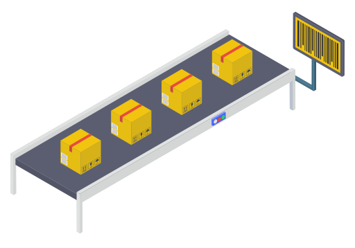
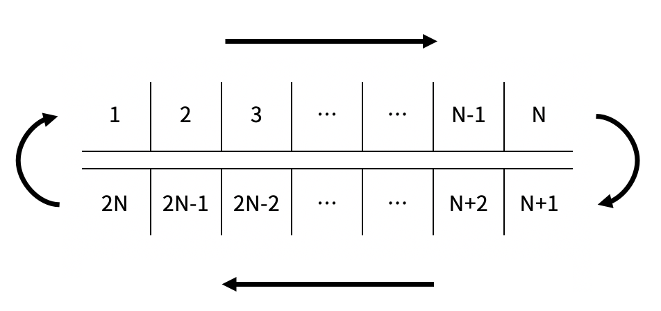

# 201105 20055 컨베이어 벨트 위의 로봇

## 문제

길이가 N인 컨베이어 벨트가 있고, 길이가 2N인 벨트가 이 컨베이어 벨트를 위아래로 감싸며 돌고 있다. 벨트는 길이 1 간격으로 2N개의 칸으로 나뉘어져 있으며, 각 칸에는 아래 그림과 같이 1부터 2N까지의 번호가 매겨져 있다.



벨트가 한 칸 회전하면 1번부터 2N-1번까지의 칸은 다음 번호의 칸이 있는 위치로 이동하고, 2N번 칸은 1번 칸의 위치로 이동한다. i번 칸의 내구도는 Ai이다. 위의 그림에서 1번 칸이 있는 위치를 "**올라가는 위치**", N번 칸이 있는 위치를 "**내려가는 위치**"라고 한다.

컨베이어 벨트에 박스 모양 로봇을 하나씩 올리려고 한다. 로봇은 올라가는 위치에만 땅에서 올라가고, 내려가는 위치에서만 땅으로 내려갈 수 있다. 내려가는 위치에 로봇이 있는 경우 로봇은 반드시 땅으로 내려가야 한다. 로봇이 어떤 칸에 올라가거나 이동하면 그 칸의 내구도는 즉시 1만큼 감소한다. 내구도가 0인 칸에는 로봇이 올라갈 수 없다.

로봇은 컨베이어 벨트 위에서 스스로 이동할 수 있다.

컨베이어 벨트를 이용해 로봇들을 건너편으로 옮기려고 한다. 로봇을 옮기는 과정에서는 아래와 같은 일이 순서대로 일어난다.

1. 벨트가 한 칸 회전한다.
2. 가장 먼저 벨트에 올라간 로봇부터, 벨트가 회전하는 방향으로 한 칸 이동할 수 있다면 이동한다. 만약 이동할 수 없다면 가만히 있는다.
   1. 로봇이 이동하기 위해서는 이동하려는 칸에 로봇이 없으며, 그 칸의 내구도가 1 이상 남아 있어야 한다.
3. 올라가는 위치에 로봇이 없다면 로봇을 하나 올린다.
4. 내구도가 0인 칸의 개수가 K개 이상이라면 과정을 종료한다. 그렇지 않다면 1번으로 돌아간다.

종료되었을 때 몇 번째 단계가 진행 중이었는지 구해보자. 가장 처음 수행되는 단계는 1번째 단계이다.

## 입력

첫째 줄에 N, K가 주어진다. 둘째 줄에는 A1, A2, ..., A2N이 주어진다.

## 출력

몇 번째 단계가 진행 중일때 종료되었는지 출력한다.

## 제한

- 2 ≤ N ≤ 100
- 1 ≤ K ≤ 2N
- 1 ≤ Ai ≤ 1,000

## 예제 입력 1 복사

```
3 2
1 2 1 2 1 2
```

## 예제 출력 1 복사

```
2
```

## 예제 입력 2 복사

```
3 6
10 10 10 10 10 10
```

## 예제 출력 2 복사

```
31
```

## 예제 입력 3 복사

```
4 5
10 1 10 6 3 4 8 2
```

## 예제 출력 3 복사

```
24
```

## 예제 입력 4 복사

```
5 8
100 99 60 80 30 20 10 89 99 100
```

## 예제 출력 4 복사

```
472
```

## 출처

- 문제를 만든 사람: [baekjoon](https://www.acmicpc.net/user/baekjoon)

## 알고리즘 분류

- [구현](https://www.acmicpc.net/problem/tag/102)
- [시뮬레이션](https://www.acmicpc.net/problem/tag/141)


## Code 201105

---

```python
import sys; input = sys.stdin.readline
from collections import deque

N, K = map(int, input().split())
conveyor = deque(map(int, input().split()))
robots = deque([0] * (2 * N))
answer = 0
turn = 1

while True:
    # 벨트 이동
    belt = conveyor.pop()
    conveyor.appendleft(belt)
    robot = robots.pop()
    robots.appendleft(robot)
    # 마지막 내려놓기
    robots[N-1] = 0
    # 로봇이동
    for i in range(N-1, 0, -1):
        if robots[i] and not robots[i+1] and conveyor[i+1]:
            robots[i+1] = robots[i]
            robots[i] = 0
            conveyor[i+1] -= 1
    # 마지막 내려놓기
    robots[N-1] = 0
    # 로봇 올리기
    if not robots[0] and conveyor[0]:
        robots[0] = 1
        conveyor[0] -= 1
    # 0 세기
    tmp = 0
    for i in conveyor:
        if not i:
            tmp += 1
    if K <= tmp:
        break
    turn += 1
print(turn)
```

