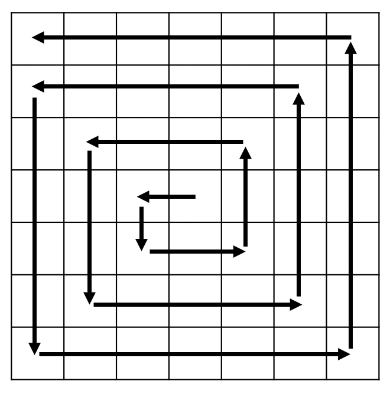
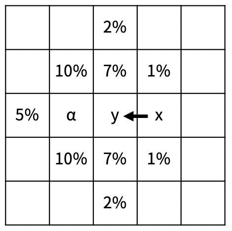

# 201108 20057 마법사 상어와 토네이도

## 문제

[마법사 상어](https://www.acmicpc.net/problem/20056)가 토네이도를 배웠고, 오늘은 토네이도를 크기가 N×N인 격자로 나누어진 모래밭에서 연습하려고 한다. 위치 (r, c)는 격자의 r행 c열을 의미하고, A[r][c]는 (r, c)에 있는 모래의 양을 의미한다.

토네이도를 시전하면 격자의 가운데 칸부터 토네이도의 이동이 시작된다. 토네이도는 한 번에 한 칸 이동한다. 다음은 N = 7인 경우 토네이도의 이동이다.



토네이도가 한 칸 이동할 때마다 모래는 다음과 같이 일정한 비율로 흩날리게 된다.



토네이도가 x에서 y로 이동하면, y의 모든 모래가 비율과 α가 적혀있는 칸으로 이동한다. 비율이 적혀있는 칸으로 이동하는 모래의 양은 y에 있는 모래의 해당 비율만큼이고, 계산에서 소수점 아래는 버린다. α로 이동하는 모래의 양은 비율이 적혀있는 칸으로 이동하지 않은 남은 모래의 양과 같다. 모래가 이미 있는 칸으로 모래가 이동하면, 모래의 양은 더해진다. 위의 그림은 토네이도가 왼쪽으로 이동할 때이고, 다른 방향으로 이동하는 경우는 위의 그림을 해당 방향으로 회전하면 된다.

토네이도는 (1, 1)까지 이동한 뒤 소멸한다. 모래가 격자의 밖으로 이동할 수도 있다. 토네이도가 소멸되었을 때, 격자의 밖으로 나간 모래의 양을 구해보자.

## 입력

첫째 줄에 격자의 크기 N이 주어진다. 둘째 줄부터 N개의 줄에는 격자의 각 칸에 있는 모래가 주어진다. r번째 줄에서 c번째 주어지는 정수는 A[r][c] 이다.

## 출력

격자의 밖으로 나간 모래의 양을 출력한다.

## 제한

- 3 ≤ N ≤ 499
- N은 홀수
- 0 ≤ A[r][c] ≤ 1,000
- 가운데 칸에 있는 모래의 양은 0

## 예제 입력 1 복사

```
5
0 0 0 0 0
0 0 0 0 0
0 10 0 0 0
0 0 0 0 0
0 0 0 0 0
```

## 예제 출력 1 복사

```
10
```

## 예제 입력 2 복사

```
5
0 0 0 0 0
0 0 0 0 0
0 100 0 0 0
0 0 0 0 0
0 0 0 0 0
```

## 예제 출력 2 복사

```
85
```

## 예제 입력 3 복사

```
7
1 2 3 4 5 6 7
1 2 3 4 5 6 7
1 2 3 4 5 6 7
1 2 3 0 5 6 7
1 2 3 4 5 6 7
1 2 3 4 5 6 7
1 2 3 4 5 6 7
```

## 예제 출력 3 복사

```
139
```

## 예제 입력 4 복사

```
5
100 200 300 400 200
300 243 432 334 555
999 111 0 999 333
888 777 222 333 900
100 200 300 400 500
```

## 예제 출력 4 복사

```
7501
```

## 예제 입력 5 복사

```
5
0 0 100 0 0
0 0 100 0 0
0 0 0 0 0
0 0 100 0 0
0 0 100 0 0
```

## 예제 출력 5 복사

```
283
```

## 예제 입력 6 복사

```
9
193 483 223 482 858 274 847 283 748
484 273 585 868 271 444 584 293 858
828 384 382 818 347 858 293 999 727
818 384 727 373 636 141 234 589 991
913 564 555 827 0 999 123 123 123
321 321 321 983 982 981 983 980 990
908 105 270 173 147 148 850 992 113
943 923 982 981 223 131 222 913 562
752 572 719 590 551 179 141 137 731
```

## 예제 출력 6 복사

```
22961
```

## 출처

- 문제를 만든 사람: [baekjoon](https://www.acmicpc.net/user/baekjoon)

## 알고리즘 분류

- [구현](https://www.acmicpc.net/problem/tag/102)
- [시뮬레이션](https://www.acmicpc.net/problem/tag/141)


## 201108 Code

---

```python
import sys; input = sys.stdin.readline

N = int(input())
sand = [list(map(int, input().split())) for _ in range(N)]
answer = 0
di = [0, 1, 0, -1]
dj = [-1, 0, 1, 0]
spread = {
    0: [[-2, 0, 0.02], [-1, -1, 0.1], [-1, 0, 0.07], [-1, 1, 0.01], [0, -2, 0.05],
        [1, -1, 0.1], [1, 0, 0.07], [1, 1, 0.01], [2, 0, 0.02]],
    1: [[0, -2, 0.02], [1, -1, 0.1], [0, -1, 0.07], [-1, -1, 0.01], [2, 0, 0.05],
        [1, 1, 0.1], [0, 1, 0.07], [-1, 1, 0.01], [0, 2, 0.02]],
    2: [[-2, 0, 0.02], [1, 1, 0.1], [-1, 0, 0.07], [1, -1, 0.01], [0, 2, 0.05],
        [-1, 1, 0.1], [1, 0, 0.07], [-1, -1, 0.01], [2, 0, 0.02]],
    3: [[0, -2, 0.02], [-1, 1, 0.1], [0, -1, 0.07], [1, 1, 0.01], [-2, 0, 0.05],
        [-1, -1, 0.1], [0, 1, 0.07], [1, -1, 0.01], [0, 2, 0.02]]
}
move = 0
x, y = N//2, N//2
for i in range(N*2-1):
    origin = i
    i %= 4
    if not i % 2:
        move += 1
    for j in range(move):
        if origin == N*2-2 and j == move-1: continue
        x += di[i]
        y += dj[i]
        remain = sand[x][y]
        tmp = 0
        if not remain: continue
        for mx, my, rate in spread[i]:
            nx = x + mx
            ny = y + my
            sand_ = int(remain*rate)
            if 0 <= nx < N and 0 <= ny < N:
                sand[nx][ny] += sand_
            else:
                answer += sand_
            tmp += sand_

        if 0 <= x+di[i] < N and 0 <= y+dj[i] < N:
            sand[x+di[i]][y+dj[i]] += sand[x][y] - tmp
        else:
            answer += sand[x][y] - tmp
        sand[x][y] = 0
print(answer)
```

